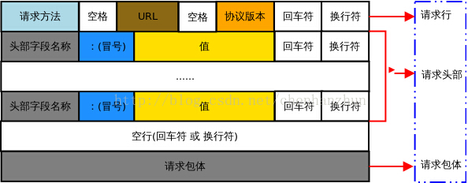

<blockquote class="blockquote-center">青山隐隐水迢迢，秋尽江南草未凋</blockquote>

　　最近看到一道与HTTP协议相关题目，感觉对计算机网络协议的知识点有点忘了，赶紧查阅资料对之前学习过的计算机网络知识做一个复习与总结。

<!-- more -->

### HTTP的概念

　　协议是指计算机通信网络中两台计算机之间进行通信所必须共同遵守的规定或规则。

　　HTTP协议，又称超文本传输协议（Hypertext transfer protocol），是一种详细规定了浏览器和万维网（WWW，World Wide Web）服务器之间互相通信的通信协议，它允许将超文本标记语言（HTML）文档从Web服务器传送到客户端的浏览器，可以使浏览器更加高效，减少网络的传输。它不仅保证计算机正确快速地传输超文本文档，还确定传输文档中的哪一部分，以及哪部分内容首先显示(如文本先于图形)等。

　　HTTP是一个应用层协议，由请求和响应构成，是一个标准的客户端服务器模型，也是一个无状态的协议。HTTP默认的端口号为80，HTTPS的端口号为443。

　　在Internet中所有的传输都是通过TCP/IP进行的。HTTP协议作为TCP/IP模型中应用层的协议也不例外。HTTP协议通常承载于TCP协议之上，有时也承载于TLS或SSL协议层之上，这个时候，就成了我们常说的HTTPS。如下图所示：


### 发展简史

　　它的发展是万维网协会（World Wide Web Consortium）和Internet工作小组IETF（Internet Engineering Task Force）合作的结果，他们最终发布了一系列的RFC，RFC 1945定义了HTTP/1.0版本。其中最著名的就是RFC 2616。RFC 2616定义了今天普遍使用的一个版本——HTTP 1.1。

### **HTTP的特点**

　　HTTP协议永远都是客户端发起请求，服务器回送响应。这样就限制了使用HTTP协议，无法实现在客户端没有发起请求的时候，服务器将消息推送给客户端。

**HTTP协议的主要特点**

1、支持CS（客户/服务器）模式，还有基本认证和安全认证。

2、简单快速：客户向服务器请求服务时，只需传送请求方法和路径。请求方法常用的有GET、HEAD、POST。每种方法规定了客户与服务器联系的类型不同。由于HTTP协议简单，使得HTTP服务器的程序规模小，因而通信速度很快。

3、灵活：HTTP允许传输任意类型的数据对象。正在传输的类型由Content-Type加以标记。

4、HTTP 0.9和1.0使用非持续连接：`限制每次连接只处理一个请求`，服务器处理完客户的请求，并收到客户的应答后，即断开连接。

5、HTTP 1.1使用持续连接：不必为每个web对象创建一个新的连接，`一个连接可以传送多个对象`，采用这种方式可以节省传输时间。

6、无状态：HTTP协议是无状态协议，无状态是指协议对于事务处理没有记忆能力。缺少状态意味着如果后续处理需要前面的信息，则它必须重传，这样可能导致每次连接传送的数据量增大。另一方面，在服务器不需要先前信息时它的应答就较快。

**无状态协议**

　　协议的状态是指下一次传输可以“记住”这次传输信息的能力。

　　HTTP是不会为了下一次连接而维护这次连接所传输的信息,为了保证服务器内存。

　　比如客户获得一张网页之后关闭浏览器，然后再一次启动浏览器，再登陆该网站，但是服务器并不知道客户关闭了一次浏览器。

　　由于Web服务器要面对很多浏览器的并发访问，为了提高Web服务器对并发访问的处理能力，在设计HTTP协议时规定Web服务器发送HTTP应答报文和文档时，不保存发出请求的Web浏览器进程的任何状态信息。这有可能出现一个浏览器在短短几秒之内两次访问同一对象时，服务器进程不会因为已经给它发过应答报文而不接受第二次服务请求。由于Web服务器不保存发送请求的Web浏览器进程的任何信息，因此HTTP协议属于无状态协议（Stateless Protocol）。

**HTTP协议是无状态的和Connection: keep-alive的区别**

　　无状态是指协议对于事务处理没有记忆能力，服务器不知道客户端是什么状态。从另一方面讲，打开一个服务器上的网页和你之前打开这个服务器上的网页之间没有任何联系。

　　HTTP是一个无状态的面向连接的协议，无状态不代表HTTP不能保持TCP连接，更不能代表HTTP使用的是UDP协议（无连接）。

　　从HTTP/1.1起，默认都开启了Keep-Alive，保持连接特性，简单地说，当一个网页打开完成后，客户端和服务器之间用于传输HTTP数据的TCP连接不会关闭，如果客户端再次访问这个服务器上的网页，会继续使用这一条已经建立的连接。

　　Keep-Alive不会永久保持连接，它有一个保持时间，可以在不同的服务器软件（如Apache）中设定这个时间。

### HTTP请求报文

　　 一个**HTTP请求报文**由**请求行（request line）**、**请求头部（header）**、**空行**和**请求数据**4个部分组成。



#### 请求行

　　**请求行**由**请求方法字段**、**URL字段**和**HTTP协议版本字段**3个字段组成。

　　**请求行**以**一个方法符号开头**，**以空格分开**，**后面跟着请求的URI和协议的版本**，格式如下：`Method Request-URI HTTP-Version CRLF`，例如，GET /index.html HTTP/1.1。

　　其中`Method表示请求方法`；`Request-URI是一个统一资源标识符`；`HTTP-Version表示请求的HTTP协议版本`；`CRLF表示回车和换行`（除了作为结尾的CRLF外，不允许出现单独的CR或LF字符）。

#### 请求头部

　　`请求头部`由`关键字/值对`组成，`每行一对`，关键字和值用英文冒号`:`分隔。请求头部通知服务器有关于客户端请求的信息，常见的请求头有：

> `User-Agent`：产生请求的浏览器类型；
>
> `Accept`：客户端可识别的响应内容类型列表；星号 `*`用于按范围将类型分组，用 `/` 指示可接受全部类型，用`type/*`指示可接受 type 类型的所有子类型
>
> `Accept-Language`：客户端可接受的自然语言；
>
> `Accept-Encoding`：客户端可接受的编码压缩格式；
>
> `Accept-Charset`：可接受的应答的字符集；
>
> `Host`：请求的主机名，允许多个域名同处一个IP 地址，即虚拟主机；
>
> `connection`：连接方式（close 或 keepalive）；
>
> `Cookie`：存储于客户端扩展字段，向同一域名的服务端发送属于该域的cookie；

####  空行

　　最后一个请求头之后是一个空行，`发送回车符和换行符`，通知服务器以下不再有请求头。

#### 请求数据

　　请求数据不在GET方法中使用，而是在POST方法中使用。POST方法适用于`需要客户填写表单的场合`。与请求数据相关的最常使用的请求头是`Content-Type和Content-Length`。

### HTTP请求方法

　　HTTP协议的请求方法有`GET、POST、HEAD、PUT、DELETE、OPTIONS、TRACE、CONNECT`。

而常见的有如下几种：

#### GET

　　最常见的一种请求方式，当客户端要从服务器中读取文档时，当点击网页上的链接或者通过在浏览器的地址栏输入网址来浏览网页的，使用的都是GET方式。GET方法要求服务器将URL定位的资源放在响应报文的数据部分，回送给客户端。使用GET方法时，请求参数和对应的值附加在URL后面，利用一个问号`?`代表URL的结尾与请求参数的开始，传递参数长度受限制。例如，/index.jsp?id=100&op=bind,这样通过GET方式传递的数据直接表示在地址中，所以我们可以把请求结果以链接的形式发送给好友。以用google搜索domety为例，Request格式如下：

```
GET /search?hl=zh-CN&source=hp&q=domety&aq=f&oq= HTTP/1.1  
Accept: image/gif, image/x-xbitmap, image/jpeg, image/pjpeg, application/vnd.ms-excel, application/vnd.ms-powerpoint, 
application/msword, application/x-silverlight, application/x-shockwave-flash, */*  
Referer: <a href="http://www.google.cn/">http://www.google.cn/</a>  
Accept-Language: zh-cn  
Accept-Encoding: gzip, deflate  
User-Agent: Mozilla/4.0 (compatible; MSIE 6.0; Windows NT 5.1; SV1; .NET CLR 2.0.50727; TheWorld)  
Host: <a href="http://www.google.cn">www.google.cn</a>  
Connection: Keep-Alive  
Cookie: PREF=ID=80a06da87be9ae3c:U=f7167333e2c3b714:NW=1:TM=1261551909:LM=1261551917:S=ybYcq2wpfefs4V9g; 
NID=31=ojj8d-IygaEtSxLgaJmqSjVhCspkviJrB6omjamNrSm8lZhKy_yMfO2M4QMRKcH1g0iQv9u-2hfBW7bUFwVh7pGaRUb0RnHcJU37y-
FxlRugatx63JLv7CWMD6UB_O_r
```

　　可以看到，GET方式的请求一般不包含`请求内容`部分，`请求数据`以`地址的形式`表现在`请求行`。地址链接如下：

```
<a href="http://www.google.cn/search?hl=zh-CN&source=hp&q=domety&aq=f&oq=">http://www.google.cn/search?hl=zh-CN&source=hp
&q=domety&aq=f&oq=</a> 
```

　　地址中`?`之后的部分就是通过GET发送的请求数据，我们可以在地址栏中清楚的看到，各个数据之间用`&`符号隔开。显然，这种方式`不适合传送私密数据`。另外，由于不同的浏览器对地址的字符限制也有所不同，`一般最多只能识别1024个字符`，所以如果需要`传送大量数据的时候，也不适合使用GET方式`。

#### POST

　　对于上面提到的不适合使用GET方式的情况，可以考虑使用POST方式，因为使用POST方法可以`允许客户端给服务器提供信息较多`。POST方法将`请求参数`封装在`HTTP请求数据`中，以`名称/值`的形式出现，可以`传输大量数据`，这样POST方式对`传送的数据大小没有限制`，而且`也不会显示在URL`中。还 以上面的搜索domety为例，如果使用POST方式的话，格式如下：

```
POST /search HTTP/1.1  
Accept: image/gif, image/x-xbitmap, image/jpeg, image/pjpeg, application/vnd.ms-excel, application/vnd.ms-powerpoint, 
application/msword, application/x-silverlight, application/x-shockwave-flash, */*  
Referer: <a href="http://www.google.cn/">http://www.google.cn/</a>  
Accept-Language: zh-cn  
Accept-Encoding: gzip, deflate  
User-Agent: Mozilla/4.0 (compatible; MSIE 6.0; Windows NT 5.1; SV1; .NET CLR 2.0.50727; TheWorld)  
Host: <a href="http://www.google.cn">www.google.cn</a>  
Connection: Keep-Alive  
Cookie: PREF=ID=80a06da87be9ae3c:U=f7167333e2c3b714:NW=1:TM=1261551909:LM=1261551917:S=ybYcq2wpfefs4V9g; 
NID=31=ojj8d-IygaEtSxLgaJmqSjVhCspkviJrB6omjamNrSm8lZhKy_yMfO2M4QMRKcH1g0iQv9u-2hfBW7bUFwVh7pGaRUb0RnHcJU37y-
FxlRugatx63JLv7CWMD6UB_O_r  

hl=zh-CN&source=hp&q=domety
```

　　可以看到，POST方式`请求行`中`不包含数据字符串`，这些数据保存在`请求内容`部分，各数据之间也是使用`&`符号隔开。POST方式大多用于`页面的表单`中。因为POST也能完成GET的功能，因此多数人在设计表单的时候一律都使用POST方式，其实这是一个误区。GET方式也有自己的特点和优 势，我们应该根据不同的情况来选择是使用GET还是使用POST。

#### HEAD

　　HEAD就像GET，只不过服务端接受到HEAD请求后`只返回响应头`，而`不会发送响应内容`。这种方法是非常高效的，因为在传输的过程中省去了页面内容。可以在`不必传输整个响应内容`的情况下，就可以获取包含在`响应消息头中的元信息`。常用于测试超链接的有效性，是否可以访问，以及最近是否更新。

#### 其他几种请求方法

OPTIONS

　　返回服务器针对特定资源所支持的HTTP请求方法。也可以利用向Web服务器发送`*`的请求来测试服务器的功能性。

PUT

　　向指定资源位置上传其最新内容。

DELETE

　　请求服务器删除Request-URI所标识的资源。

TRACE

　　回显服务器收到的请求，主要用于测试或诊断。

CONNECT

　　HTTP/1.1协议中预留给能够将连接改为管道方式的代理服务器。

　　HTTP服务器至少应该实现GET和HEAD方法，其他方法都是可选的。此外，除了上述方法，特定的HTTP服务器还能够扩展自定义的方法。

### HTTP响应报文

　　**HTTP响应**由**状态行**、**响应头部**、**空行**和**响应正文**4个部分组成。


#### 状态行

　　**状态行**由**HTTP协议版本字段**、**状态码**和**状态码的描述文本**3个部分组成，他们之间使用空格隔开。

　　状态行格式：`HTTP-Version Status-Code Reason-Phrase CRLF`

　　其中，`HTTP-Version表示服务器HTTP协议的版本`；`Status-Code表示服务器发回的响应状态代码`；`Reason-Phrase表示状态代码的文本描述`。

#### 响应头部

　　响应报头允许服务器传递不能放在状态行中的附加响应信息，以及关于服务器的信息和对Request-URI所标识的资源进行下一步访问的信息。

　　常见的响应头部有：

　　**Allow：**服务器支持哪些请求方法（如GET、POST等）。

　　**Location：**Location 响应报头域用于重定向接受者到一个新的位置。例如：客户端所请求的页面已不存在原先的位置，为了让客户端重定向到这个页面新的位置，服务器端可以发回Location响应报头后使用重定向语句，让客户端去访问新的域名所对应的服务器上的资源;

　　**Server：**Server 响应报头域包含了服务器用来处理请求的软件信息及其版本。它和 User-Agent 请求报头域是相对应的，前者发送服务器端软件的信息，后者发送客户端软件（浏览器）和操作系统的信息。

　　更多详细的响应头信息可以点击👉[传送门](https://www.runoob.com/http/http-header-fields.html)

#### 空行

　　最后一个响应头部之后是一个空行，发送回车符和换行符，通知服务器以下不再有响应头部。

#### 响应正文

　　服务器返回给客户端的文本信息。

### HTTP响应状态码

　　HTTP状态码（响应码）用来表明HTTP请求是否已经成功完成。

　　状态代码有三位数字组成，第一个数字定义了响应的类别，常用的状态码有五大类。

- **1xx**：指示信息--表示请求已接收，继续处理
- **2xx**：成功--表示请求已被成功接收、理解、接受
- **3xx**：重定向--要完成请求必须进行更进一步的操作
- **4xx**：客户端错误--请求有语法错误或请求无法实现
- **5xx**：服务器端错误--服务器未能实现合法的请求

　　具体的状态代码和状态描述的说明如下：

**1xx（信息类）**：**表示接收到请求并且继续处理**
100——客户必须继续发出请求
101——客户要求服务器根据请求转换HTTP协议版本

**2xx（响应成功）**：**表示动作被成功接收、理解和接受**
200——表明该请求被成功地完成，所请求的资源发送回客户端
201——提示知道新文件的URL
202——接受和处理、但处理未完成
203——返回信息不确定或不完整
204——请求收到，但返回信息为空
205——服务器完成了请求，用户代理必须复位当前已经浏览过的文件
206——服务器已经完成了部分用户的GET请求

**3xx（重定向类）**：**为了完成指定的动作，必须接受进一步处理**
300——请求的资源可在多处得到
301——本网页被永久性转移到另一个URL
302——请求的网页被转移到一个新的地址，但客户访问仍继续通过原始URL地址，重定向，新的URL会在response中的Location中返回，浏览器将会使用新的URL发出新的Request。
303——建议客户访问其他URL或访问方式
304——自从上次请求后，请求的网页未修改过，服务器返回此响应时，不会返回网页内容，代表上次的文档已经被缓存了，还可以继续使用
305——请求的资源必须从服务器指定的地址得到
306——前一版本HTTP中使用的代码，现行版本中不再使用
307——申明请求的资源临时性删除

**4xx（客户端错误类）**：**请求包含错误语法或不能正确执行**
400——客户端请求有语法错误，不能被服务器所理解
401——请求未经授权，这个状态代码必须和WWW-Authenticate报头域一起使用
HTTP 401.1 - 未授权：登录失败
HTTP 401.2 - 未授权：服务器配置问题导致登录失败
HTTP 401.3 - ACL 禁止访问资源
HTTP 401.4 - 未授权：授权被筛选器拒绝
HTTP 401.5 - 未授权：ISAPI 或 CGI 授权失败
402——保留有效ChargeTo头响应
403——禁止访问，服务器收到请求，但是拒绝提供服务
HTTP 403.1 禁止访问：禁止可执行访问
HTTP 403.2 - 禁止访问：禁止读访问
HTTP 403.3 - 禁止访问：禁止写访问
HTTP 403.4 - 禁止访问：要求 SSL
HTTP 403.5 - 禁止访问：要求 SSL 128
HTTP 403.6 - 禁止访问：IP 地址被拒绝
HTTP 403.7 - 禁止访问：要求客户证书
HTTP 403.8 - 禁止访问：禁止站点访问
HTTP 403.9 - 禁止访问：连接的用户过多
HTTP 403.10 - 禁止访问：配置无效
HTTP 403.11 - 禁止访问：密码更改
HTTP 403.12 - 禁止访问：映射器拒绝访问
HTTP 403.13 - 禁止访问：客户证书已被吊销
HTTP 403.15 - 禁止访问：客户访问许可过多
HTTP 403.16 - 禁止访问：客户证书不可信或者无效
HTTP 403.17 - 禁止访问：客户证书已经到期或者尚未生效
404——可连接服务器，但服务器无法取得所请求的网页，请求资源不存在。比如输入了错误的URL
405——用户在Request-Line字段定义的方法不允许
406——根据用户发送的Accept拖，请求资源不可访问
407——类似401，用户必须首先在代理服务器上得到授权
408——客户端没有在用户指定的饿时间内完成请求
409——对当前资源状态，请求不能完成
410——服务器上不再有此资源且无进一步的参考地址
411——服务器拒绝用户定义的Content-Length属性请求
412——一个或多个请求头字段在当前请求中错误
413——请求的资源大于服务器允许的大小
414——请求的资源URL长于服务器允许的长度
415——请求资源不支持请求项目格式
416——请求中包含的Range头字段无法被满足,通常是因为Range中的数字范围超出所请求资源的大小
417——服务器不满足请求Expect头字段指定的期望值，如果是代理服务器，可能是下一级服务器不能满足请求长。

**5xx（服务端错误类）**：**服务器不能正确执行一个正确的请求**
HTTP 500 - 服务器遇到错误，无法完成请求
HTTP 500.100 - 内部服务器错误 - ASP 错误
HTTP 500-11 服务器关闭
HTTP 500-12 应用程序重新启动
HTTP 500-13 - 服务器太忙
HTTP 500-14 - 应用程序无效
HTTP 500-15 - 不允许请求 global.asa
Error 501 - 未实现
HTTP 502 - 网关错误
HTTP 503：由于超载或停机维护，服务器目前无法使用，一段时间后可能恢复正常

　　更多详细的响应状态码信息可以点击👉[传送门](https://www.runoob.com/http/http-status-codes.html)

### HTTP请求GET和POST的区别

1、数据提交的方式

　　GET提交：请求的数据会附在URL之后（就是把数据放置在HTTP协议头＜request-line＞中）， 以`?`分割`URL`和`传输数据`，多个参数用`&`连接；例如：login.action?name=hyddd& password=idontknow&verify=%E4%BD%A0 %E5%A5%BD。如果数据是`英文字母/数字`，原样发送，如果是`空格`，转换为`+`，如果是`中文/其他字符`，则直接把字符串用`BASE64加密`，得出如： %E4%BD%A0%E5%A5%BD，其中％XX中的XX为该符号以`16进制表示的ASCII`。

　　POST提交：把提交的数据放置在是HTTP包的包体＜request-body＞中。

　　**因此，GET提交的数据会在地址栏中显示出来，而POST提交，地址栏不会改变**

2、传输数据的大小：

　　首先声明，HTTP协议没有对传输的数据大小进行限制，HTTP协议规范也没有对URL长度进行限制。 而在实际开发中存在的限制主要有：

　　GET：特定浏览器和服务器对URL长度有限制，例如IE对URL长度的限制是2083字节(2K+35)。对于其他浏览器，如Netscape、FireFox等，理论上没有长度限制，其限制取决于操作系统的支持。

　　**因此，对于GET提交时，传输数据就会受到URL长度的限制。**

　　POST：由于不是通过URL传值，理论上数据不受限。但实际各个WEB服务器会规定对post提交数据大小进行限制，Apache、IIS6都有各自的配置。

3、安全性：

　　POST的安全性要比GET的安全性高。

　　注意：这里所说的安全性和上面GET提到的“安全”不是同个概念。上面“安全”的含义仅仅是不作数据修改，而这里安全的含义是真正的Security的含义。比如：通过GET提交数据，用户名和密码将明文出现在URL上，因为(1)登录页面有可能被浏览器缓存， (2)其他人查看浏览器的历史纪录，那么别人就可以拿到你的账号和密码了。

### 参考资料

- [HTTP请求报文和HTTP响应报文](https://www.cnblogs.com/rainydayfmb/p/5319318.html)
- [HTTP协议详解](https://blog.csdn.net/gueter/article/details/1524447)
- [HTTP 请求方法 | 菜鸟教程](https://www.runoob.com/http/http-methods.html)
- [http请求报文格式和响应报文格式](https://www.cnblogs.com/CodingUniversal/p/7524088.html)
- [HTTP协议详解](https://www.cnblogs.com/EricaMIN1987_IT/p/3837436.html)
- [HTTP五大类响应类型含义](https://blog.csdn.net/HY845638534/article/details/91448199)