<blockquote class="blockquote-center">云淡风轻近午天，傍花随柳过前川。</blockquote>

　　OSI七层协议模型主要有：应用层(Application)、表示层(Presentation)、会话层(Session)、传输层(Transport)、网络层(Network)、数据链路层(Data Link)、物理层(Physical)。

<!-- more -->
　　OSI(Open System Interconnect)，即开放式系统互联参考模型，一般都叫OSI参考模型，是ISO（国际标准化组织）在1985年提出的一个试图将各种计算机或者通信系统在世界范围内互联为网络的标准框架模型。在这一框架下详细的规定了每一层的功能，以实现开放系统环境中的互连性、相互操作性和应用的可移植性。

### 协议

####  常见的协议

　　互联网中代表性的协议有IP、TCP、HTTP等，LAN中常用协议有IPX、SPX等。

　　`计算机网络体系结构`将这些网络协议进行了系统的归纳，TCP/IP就是这些协议的集合。除此以外，还有Novell公司的IPX/SPX、苹果公司的AppleTalk（仅限苹果公司计算机使用）、IBM开发的用于构件大规模网络的SNA以及前DEC公司开发的DECnet等。

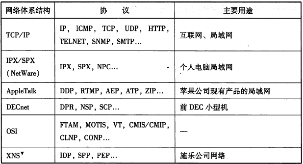

#### 协议的必要性

　　协议是计算机之间通过网络实现通信时事先达成的一种约定；这种约定使那些由不同厂商的设备，不同CPU及不同操作系统组成的计算机之间，只要遵循相同的协议就可以实现通信。

　　协议可以分很多种，每一种协议都明确界定了它的行为规范：2台计算机之间必须能够支持相同的协议，并且遵循相同的协议进行处理，才能实现相互通信。

#### 分组交换协议

　　将大数据分割为一个个叫做包（Packet）的较小单位进行传输。

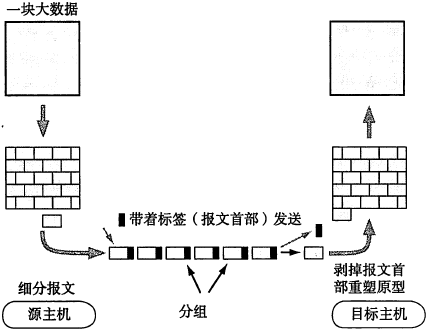

　　计算机通信会在每一个分组中附加上源主机地址和目标主机地址送给通信线路；这些`发送端地址`、`接收端地址`以及`分组序号写入的部分`就是`报文首部`。

　　一个较大的数据被分为很多个分组，为了标明原始数据的归属，有必要将分组序号写入包中，接收端会根据序号，分组按序重新装配为原始数据。

　　协议中，通常会规定报文首部应写入哪些信息，如何处理；相互通信的每台计算机则根据协议构造报文首部，读取首部等内容，发送和接收方必须对报文首部和主体保持一致的定义和解释。

### 协议的标准化

　　计算机通信诞生之初，系统化与标准化未收到重视，不同厂商只出产各自的网络来实现通信，这样就造成了对用户使用计算机网络造成了很大障碍，缺乏灵活性和可扩展性。

　　为解决该问题，ISO（国际标准化组织）制定了一个国际标准OSI（开放式通信系统互联参考模型），而TCP/IP并非ISO指定，是由IETF（国际互联网工程任务组）建议、致力推进标准化的一种协议，协议的标准化推动了计算机网络的普及。

### 协议的分层

　　ISO在指定标准的OSI之前，提出了作为通信协议设计指标的OSI参考模型，将协议分为七层，使得原来复杂的网络协议更加简单化。

　　在七层模型中，每个分层都接受由它下一层所提供的特定服务，并且负责为自己的上一层提供特定的服务，上下层之间进行交互所遵循的约定叫做接口，同一层之间的交互所遵循的约定叫做协议。

#### 协议分层的优点

　　每个分层可以独立使用，其实系统中某些分层发生变化，也不会影响整个系统，因此可以构造一个扩展性和灵活性都比较强的系统；

　　此外，通过分层可以细分通信功能，更易于单独实现每个分层的协议，界定各个分层的具体责任和义务 

#### 协议分层的劣势

　　过分模块化，处理变得更加沉重，以及每个模块都不得不事先相似的处理逻辑等。

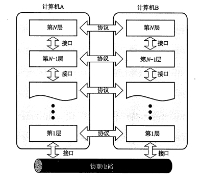

 

### OSI参考模型

　　互联网的本质就是一系列的网络协议，这个协议就叫OSI协议（一系列协议），按照功能不同，分工不同，人为的分层七层。实际上这个七层是不存在的。没有这七层的概念，只是人为的划分而已。区分出来的目的只是让你明白哪一层是干什么用的。

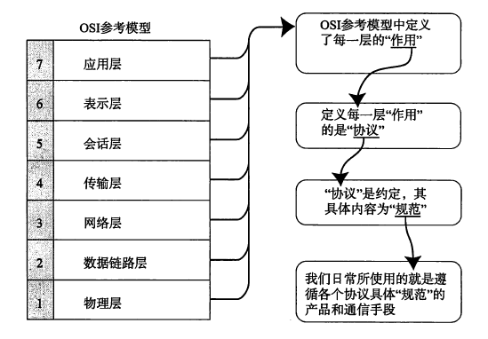

　　还有人把它划成五层、四层，不管划分为几层，目的都是为了更好的理解这个模型。

`七层划分为`：应用层、表示层、会话层、传输层、网络层、数据链路层、物理层。

`五层划分为`：应用层、传输层、网络层、数据链路层、物理层。

`四层划分为`：应用层、传输层、网络层、网络接口层。

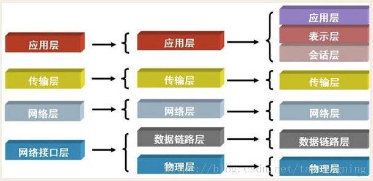

### OSI七层模型各层作用

|   OSI七层模型   |   功能   |   对应的网络协议   |   每层功能概况   |
| ------------- | ------------- | ------------- | ------------- |
| 应用层      | 文件传输，文件管理，电子邮件的信息处理——apdu               | HTTP，TFTP，FTP，NFS，WAIS，SMTP                             | 文件传输——文件传输协议、电子邮件——电子邮件服务、远程登陆——远程登陆协议 |
| 表示层      | 确保一个系统的应用层发送的消息可以被另一个系统的应用层读取，编码转换，数据解析，管理数据的解密和加密，最小单位——ppdu | Telnet，Rlogin，SNMP，Gopher                                 | 接受不同表现形式的信息，比如文字流、图像、声音等 |
| 会话层      | 负责在网络中的两节点建立，维持和终止通信，在一层协议中，可以解决节点连接的协调和管理问题。包括通信连接的建立，保持会话过程通信连接的畅通，两节点之间的对话，决定通信是否被中断以及通信中断时决定从何处重新发送，最小单位——spdu | SMTP，DNS                                                    | 何时建立连接，何时断开连接以及保持多久的连接 |
| 运输层     | 定义一些传输数据的协议和端口。传输协议同时进行流量控制，或是根据接收方接收数据的快慢程度，规定适当的发送速率，解决传输效率及能力的问题——tpdu | TCP，UDP                                                     | 是否有数据丢失 |
| 网络层      | 控制子网的运行，如逻辑编址，分组传输，路由选择最小单位——分组（包）报文 | IP，ICMP，ARP，RARP，AKP，UUCP                               | 经过哪个路由传递到目标地址 |
| 数据链路层  | 主要是对物理层传输的比特流包装，检测保证数据传输的可靠性，将物理层接收的数据进行MAC（媒体访问控制）地址的封装和解封装，也可以简单的理解为物理寻址。交换机就处在这一层，最小的传输单位——帧 | FDDI，Ethernet，Arpanet，PDN，SLIP，PPP，STP，HDLC，SDLC，帧中继 | 数据帧与比特流之间的转换 |
| 物理层      | 定义物理设备的标准，主要对物理连接方式，电气特性，机械特性等制定统一标准，传输比特流，因此最小的传输单位——位（比特流） | IEEE 802.1A，IEEE 802.2到IEEE 802. 11                        | 比特流与电子信号之间的切换 |

#### 物理层

　　主要定义了`物理设备的标准`，如网线的接口类型、光纤的接口类型、各种传输介质的传输速率等。它的主要作用是传输比特流，就是由1、0转化为电流强弱来进行传输，到达目的地后在转化为1、0，也就是我们常说的数模转换与模数转换。这一层的数据叫做比特。

#### 数据链路层

　　`数据链路层就是来对电信号来做分组的`，该层的作用包括了物理地址寻址，数据的成帧，流量控制，数据的检错，重发等。该层控制网络层与物理层之间的通信，解决的是所传输数据的准确性的问题。为了保证传输，从网络层接收到的数据被分制成特定的可被物理层传输的帧。帧是用来移动数据的结构包，它不仅包括原始数据，还包括发送方和接收方的物理地址以及纠错和控制的信息。其中的地址确定了帧将发送的位置，纠错和控制信息则保证帧的准确到达。如果传送数据的过程中，接收点检测到数据有错误，就通知发送方重新发送这一帧。

　　`Ethernet规定`：一组电信号称之为一个数据包，或者叫做一个帧。

　　`每一数据帧分成`：报头head和数据data两部分。

　　`head包含`：固定18个字节，发送者（源地址，6个字节），接收者（目标地址，6个字节），数据类型（6个字节）。

　　`data包含`：最短46字节，最长1500字节。

　　`数据包的具体内容`：head长度+data长度=最短64字节，最长1518字节，超过最大限制就分片发送。

　　这就像写信，发送者的地址（源地址）就是你家的地址，接收者地址（目标地址）就是对方的收信地址，你家的路由器就相当于邮局。其实在计算机通信中的源地址和目标地址指的是mac地址。

　　`head中包含的源和目标地址`：Ethernet规定接入Internet的设备都必须具备网卡，发送端的和接收端的地址便是指网卡的地址，即Mac地址。

　　`MAC地址`（Media Access Control或者Medium Access Control）：媒体访问控制，或称为物理地址、硬件地址，用来定义网络设备的位置。在OSI模型中，第三层网络层负责IP地址，第二层数据链路层则负责MAC地址。因此一个主机会有一个MAC地址，而每个网络位置会有一个专属于它的IP地址。

　　MAC地址是网卡决定的，是固定的。用来表示互联网上每一个站点的标识符，采用十六进制数表示，共6个字节（48位）。其中，前三个字节是由IEEE的注册管理机构RA负责给不同厂家分配的代码(高位24位），也称为“编制上唯一的标识符”，后三个字节（低位24位）由各厂家自行指派给生产的适配器接口，称为扩展标识符（唯一性）。一个地址块可以生成224个不同的地址。MAC地址实际上就是适配器地址或适配器标识符EUI-48。

　　MAC地址对应于OSI参考模型的第二层数据链路层，工作在数据链路层的交换机维护着计算机MAC地址和自身端口的数据库，交换机根据收到的数据帧中的“目的MAC地址”字段来转发数据帧。

　　IP地址工作在OSI参考模型的第三层网络层。两者之间分工明确，默契合作，完成通信过程。IP地址专注于网络层，将数据包从一个网络转发到另外一个网络；而MAC地址专注于数据链路层，将一个数据帧从一个节点传送到相同链路的另一个节点。

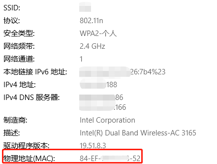

　　有了mac地址以后，计算机就可以通信了，假设一个教室就是一个局域网（隔离的网络），这个教室里面有几台计算机，计算机的通信和人的通信是一个道理，把教室里面的人都比作一个个计算机，假设教室里面的人都是瞎子，其实计算机就是瞎子的，计算机通信基本靠吼，现在我要找教室里面的飞哥要战狼2的片，然后我就吼一声，说我要找飞哥要战狼2的片，战狼2的片就属于我的数据，但是我在发的时候我是不是要标识我是谁，我要找谁，我是谁就是我的mac地址，我要找谁就是飞哥的mac地址，这两个地址做数据包的头部，再加上数据战狼2的片就构成了一个数据帧。

　　这个数据包封装好以后就往外发，到物理层以后就全部转成二级制，往外发是怎么发的呢？就是靠吼。即“我是Edison，我找飞哥要战狼2的片”。这么吼了一嗓子以后，全屋子的人都能听到，这就是广播。

　　计算机底层，只要在一个教室里（一个局域网），都是靠广播的方式，吼。

　　局域网的理解：什么是互联网，互联网就是由一个个局域网组成，局域网内的计算机不管是对内还是对外都是靠吼，这就是数据链路层的工作方式-----广播。

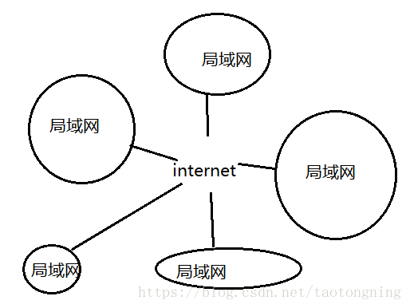

　　广播出去以后，所有人都听得见，所有人都会拆开这个包，读发送者是谁，接收者是谁，只要接收者不是自己就丢弃掉。对计算机来说，它会看自己的Mac地址，飞哥收到以后，他就会把片发给我，发送回来同样采用广播的方式了，靠吼。

　　同一个教室（同一个局域网）的计算机靠吼来通信，那不同教室的计算机又如何？

　　比如说局域网1的pc1与局域网2的pc10如何通信？你在教室1（局域网1）吼，教室2（局域网2）的人肯定是听不见的。这就是跨网络进行通信，数据链路层就解决不了这个问题了，这就得靠网络层出面了。

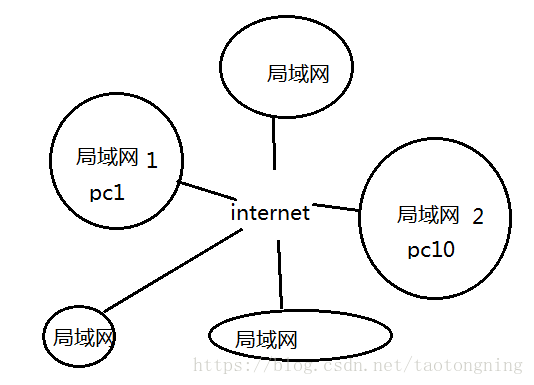

　　在讲网络层之前，其实基于广播的这种通信就可以实现全世界通信了，你吼一声，如果全世界是一个局域网，全世界的计算机肯定可以听得见，从理论上似乎行得通，如果全世界的计算机都在吼，你想一想，这是不是一个灾难。因此，全世界不能是一个局域网。于是就有了网络层。

#### 网络层

　　网络层定义了一个IP协议，你想，我是这个教室的一个学生，我想找隔壁教室一个叫老王的学生，我也不认识老王，那怎么办，我吼？老王在另外一个教室肯定是听不到的。找教室的负责人，这个教室的负责人就负责和隔壁教室的负责人说话，说我们教室的有个学生要找你们教室的老王。往外传的东西交给负责人就可以了，内部的话上面已经提到，通过广播的方式，对外的东西广播失效。教室的负责人就是网关，网关即网络关口的意思。

　　Mac地址是用来标识你这个教室的某个位置，IP地址是用来标识你在哪个教室（哪个局域网）。你要跨网络发包你是不是要知道对方的IP地址，比如你要访问百度，你肯定得知道百度服务器的IP地址。计算机在发包前，会判断你在哪个教室，对方在哪个教室，如果在一个教室，基于mac地址的广播发包就OK了；如果不在一个教室，即跨网络发包，那么就会把你的包交给教室负责人（网关）来转发。Mac地址及IP地址唯一标识了你在互联网中的位置。

　　数据链路层中会把网络层的数据包封装到数数据链路层的数据位置，然后再添加上自己的包头，再发给物理层，物理层发给网关，网关再发给对方教室的网关，对方教室的网关收到后在那个教室做广播。

　　在数据链路层看，数据封装了两层，跟玩俄罗斯套娃有点类似，一层套了一层。

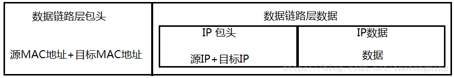

　　最终变成

　　现在来看另一个问题，在吼之前怎么知道对方的Mac地址？这就得靠ARP协议。

　　ARP协议的由来：在你找飞哥要片之前，你的先干一件事，想办法知道飞哥的Mac地址。即你的机器必须先发一个ARP包出去，ARP也是靠广播的方式发，ARP发送广播包的方式如下：

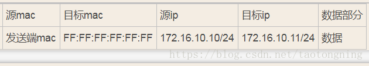

　　局域网中怎么获取对方的Mac地址：

　　肯定要知道对方的IP地址，这是最基本的，就像你要访问百度，肯定得知道百度的域名，域名就是百度的IP地址。自己的IP可以轻松获得，自己的Mac也轻松获取，目标Mac为12个F，我们叫广播地址，表达的意思是我想要获取这个目标IP地址172.16.10.11的机器的Mac地址。Mac为12个F代表的是一种功能，这个功能就是获取对方的MAC地址，计算机的Mac永远不可能是12个F。假设是在本教室广播，一嗓子吼出去了，所有人开始解包，只有IP地址是172.16.10.11的这个人才会返回他的Mac地址，其他人全部丢弃。发回来源Mac改成飞哥自己的Mac地址，同时把飞哥的Mac地址放在数据部分。

　　跨网络怎么获取对方的Mac地址：

　　通过IP地址区分，计算机运算判断出飞哥不在同一个教室，目标IP就变成了网关的IP了。网关的IP在计算机上配死了，可以轻松获取。

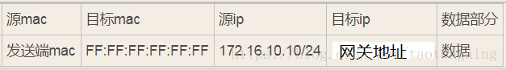

　　这样网关就会把它的Mac地址返回给你，然后正常发包

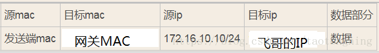

　　网关帮你去找飞哥，但对用户来说，我们根本就感觉不到网关的存在。

#### 运输层

　　网络层的ip帮我们区分子网，以太网层的mac帮我们找到主机，然后大家使用的都是应用程序，你的电脑上可能同时开启qq，暴风影音，等多个应用程序，

　　那么我们通过ip和mac找到了一台特定的主机，如何标识这台主机上的应用程序，答案就是端口，端口即应用程序与网卡关联的编号。

　　运输层的主要作用就是建立端口到端口的通信。

　　运输层定义了一些传输数据的协议和端口号（WWW端口80等），如：

　　TCP——传输控制协议，可靠传输，数据包没有长度限制，理论上可以无限长，但是为了保证网络的效率，通常TCP数据包的长度不会超过IP数据包的长度，以确保单个TCP数据包不必再分割。**用于传输可靠性要求高，数据量大的数据**。

　　UDP——用户数据报协议，与TCP特性恰恰相反，不可靠传输，”报头”部分一共只有8个字节，总长度不超过65,535字节，正好放进一个IP数据包。**用于传输可靠性要求不高，数据量小的数据**，如QQ聊天数据就是通过这种方式传输的。

#### 会话层

　　会话层负责在网络中的两节点之间建立，维持和终止通信，在这层协议中，解决节点链接的协调和管理问题。
　　会话层的功能包括：建立通信链接，保持会话过程通信连接的畅通。同步两个节点之间的对话，决定通信是否被中断以及通信中断时决定从何处重新发送。当通过拨号向你的ISP（因特网服务提供商）请求链接到因特网时，ISP服务器上的层就会向你与你的PC客户机上的会话层进行协商链接。若你的电话线偶然从墙上插孔脱落，你终端机上的会话层将检测到链接中断并重新发起链接。会话层通过决定节点通信的优先级和通信市场来设置通信期限。

#### 表示层

　　表示层是应用程序和网络之间的翻译官。可确保一个系统的应用层所发送的信息可以被另一个系统的应用层读取。在表示层，数据需要按照网络所能理解的方案的进行格式化。这种格式化因为使用网络的类型的不同而不同。表示层管理数据的加密和解密，例如银行账户，账户数据发送前加密，接受的时候对账户进行解密。

#### 应用层

　　应用层由来：用户使用的都是应用程序，均工作于应用层，互联网是开发的，大家都可以开发自己的应用程序，数据多种多样，必须规定好数据的组织形式 。

应用层功能：规定应用程序的数据格式，提供数据接口的标准，提供的服务包括文件的传输，文件的管理以及电子邮件的信息处理等

　　例如：TCP协议可以为各种各样的程序传递数据，比如Email、WWW、FTP等等。那么，必须有不同协议规定电子邮件、网页、FTP数据的格式，这些应用程序协议就构成了”应用层”。

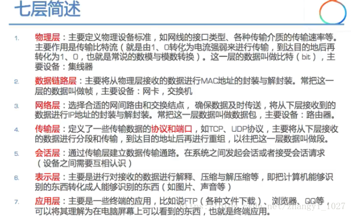

#### 数据包的完整格式

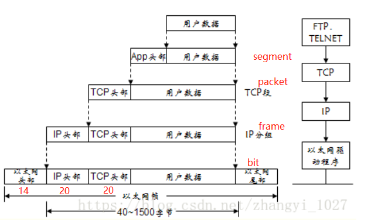

### OSI七层模型各层协议

物理层：EIA/TIA-232，EIA/TIA-499，V.35，V.24，RJ45，Ethernet，802.3，802.5，FDDI，NRZI，NRZ，B8ZS

数据链路层：Frame Relay，HDLC，PPP，IEEE 802.3/802.2，FDDI，ATM，IEEE 802.5/802.2 

网络层：IP，IPX，AppleTalk DDP 

传输层：TCP，UDP，SPX 

会话层：RPC，SQL，NFS，NetBIOS，names，AppleTalk，ASP，DECnet，SCP 

表示层:TIFF，GIF，JPEG，PICT，ASCII，EBCDIC，encryption，MPEG，MIDI，HTML 

应用层：FTP，WWW，Telnet，NFS，SMTP，Gateway，SNMP

### 参考资料

- [OSI七层协议大白话解读](https://blog.csdn.net/taotongning/article/details/81352985)
- [OSI七层模型及各层作用](https://blog.csdn.net/zhangyi_1027/article/details/80022493)
- [[OSI七层协议模型、TCP/IP四层模型和五层协议体系结构之间的关系](https://www.cnblogs.com/wxd0108/p/7597216.html)]
- [OSI七层模型的每一层都有哪些协议](https://blog.csdn.net/lisa890608/article/details/8231666)
- [对于网络OSI七层和TCP/IP五层的理解](https://msd.misuland.com/pd/2884250171976192450)