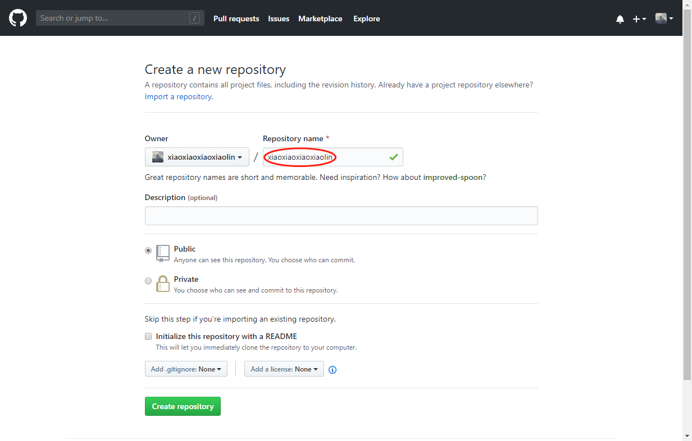
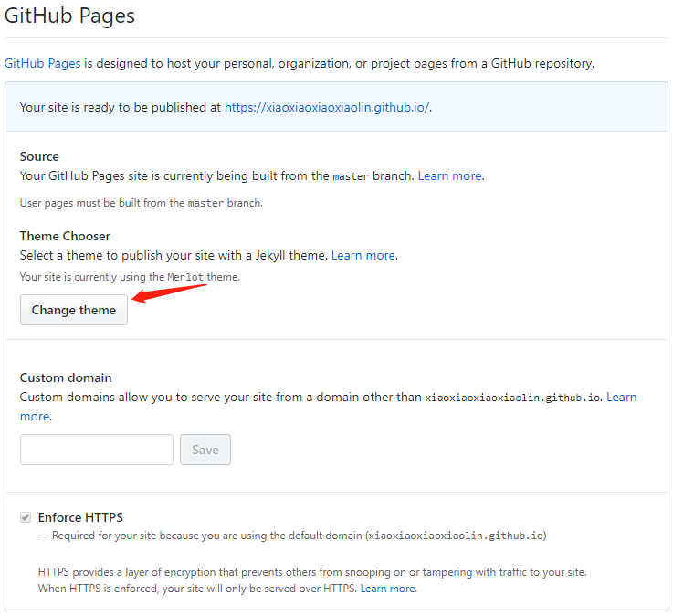
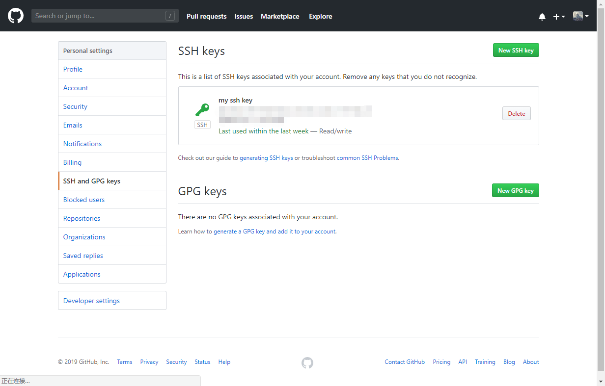
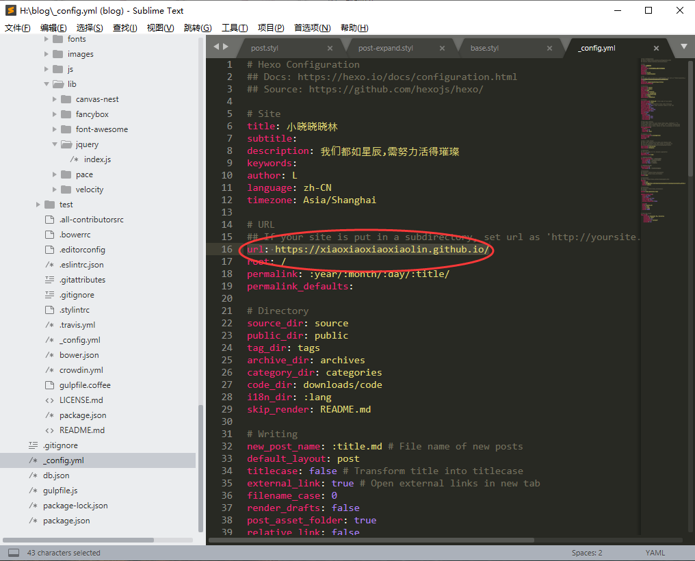

<blockquote class="blockquote-center">海阔凭鱼跃，天高任鸟飞。
</blockquote>

　　早在初中，就想着自己搭起一个属于自己的网站，但是没有技术又不肯学习的我，怯于尝试，一直停滞不前。大学期间终于学习了，又因为自己的懒惰，觉得很难，不肯去尝试。直至今日，我想试一试，捣鼓了好一阵子，发现认真去做了，也没有想象中的难。

<!-- more -->

　　其实早在放假之前，我就一直在捣鼓自己的博客了，使用的是[Django](https://www.djangoproject.com/)。搞了好一阵子，就只剩一些细节的问题，准备上线的时候，[Hexo](https://hexo.io/zh-cn/)出现在我的眼前,简约的风格一下子吸引了我，这正是我想要的。好了，别说了，我改还不行吗，就这样我已经搭好准备上线的Django，转入Hexo。

### 自己建站的原因

　　网上这么多现成的博客不用，为什么非得浪费这么多时间去自己搭建呢？
　　可能会有人这样说：很多网站都能写博客，干嘛这么浪费时间呢？
　　在这里我说一下我想自己搭建的原因:
　　1、网上大部分的博客功能都是差不多的，但是限制也是挺多的，花里胡哨的广告，文章不管是自己还是别人看，体验都很不舒服。
　　2、除了广告的原因，排版的限制以外，拥有一个自己可以随意定制的博客网站，内容和排版都自己可以随意决定，是不是很酷。
　　除此以外，自己在这段时间确实学习到了很多。宅在家里好一段时间，除了吃饭睡觉就是搭建自己的博客。搭建博客也是成为了我学习的动力，现在搭建好了之后，也不会觉得没有事情干，相反，会因为博客的空白而继续努力学习、写博客、写自己的想法，努力让自己的博客、生活、还有学习充实起来。

### 开始搭建博客

什么是Hexo？

　　Hexo是一个快速、简洁且高效的博客框架。Hexo 使用 [Markdown](http://daringfireball.net/projects/markdown/)（或其他渲染引擎）解析文章，在几秒内，即可利用靓丽的主题生成静态网页。
#### 环境部署

Hexo安装前提

　　安装 Hexo 相当简单。然而在安装前，必须检查电脑中是否已安装下列应用程序：
- [Node.js](http://nodejs.org/) (Should be at least nodejs 6.9)
- [Git](http://git-scm.com/)

　　如果你的电脑中已经安装上述必备程序，那么恭喜！接下来只需要使用 npm 即可完成 Hexo 的安装。
```
npm install -g hexo-cli
```

　　如果你的电脑中尚未安装所需要的程序，请自行百度或者Google完成安装。
　　安装好所有环境之后，可以用以下命令是否安装成功，如果有返回版本信息说明安装成功。
```
git version
node -v
npm -v
```


#### Hexo安装

- 安装hexo

　　桌面右键点击git bash here，打开git软件界面，输入以下命令并回车：
```
npm install hexo-cli -g
npm install hexo-deployer-git --save
```

　　第一句是安装hexo，第二句是安装hexo部署到git page的deployer。
- 设置博客存放的目录

```
hexo init /h/blog
cd /h/blog
npm install
*注：/h/bog可以更改为你自己的文件夹*
```

　　有的教程是先建立起博客的文件夹，再在该文件夹下右键鼠标，点击Git Bash Here，进入Git命令框，再执行以下操作。操作因人而异，没多大影响，只要能成功搭建就没问题了。
- 查看博客的效果

　　至此，一个博客就初步搭建好了，先预览一下：
```
hexo g && hexo s
```

　　然后在浏览器中打开：localhost:4000就可以看到博客的样子了。


　　打开该网址，你可以看到第一篇默认的博客：**Hello World**。虽然看起来有点难看，但是后续我们可以通过重新选择模板来对博客进行美化。
#### 把博客部署到GitHub

##### Github账号注册及配置

　　如果你没有github帐号，就新建一个，然后去邮箱进行验证；如果你有帐号则直接登录。官网：https://github.com/
##### 建立new repository

　　只填写username.github.io即可，然后点击`create repositrory`。
　　注意：`username.github.io` 的`username`要和用户名保持一致，不然后面会失败。以我的为例：




##### 开启gh-pages功能

　　点击github主页点击头像下面的profile,找到新建立的username.github.io文件打开，点击settings，往下拉动鼠标到GitHub Pages。
    如果你看到上方出现以下警告：

> GitHub Pages is currently disabled. You must first add content to your repository before you can publish a GitHub Pages site

　　不用管，点击选择`choose a theme`，随便选择一个，然后select theme保存就行了。




##### 配置ssh密钥

　　配置Github的SSH密钥可以让本地git项目与远程的github建立联系，让我们在本地写了代码之后直接通过git操作就可以实现本地代码库与Github代码库同步。操作如下：
- 看看是否存在SSH密钥

　　首先，我们需要看看是否看看本机是否存在SSH keys,打开Git Bash,并运行：
```
cd ~/. ssh 
```

　　检查你本机用户home目录下是否存在.ssh目录
　　如果，不存在此目录，则进行第二步操作，否则，你本机已经存在ssh公钥和私钥，可以略过第二步，直接进入第三步操作。
- 创建一对新的SSH密钥

```
$ssh-keygen -t rsa -C "your_email@example.com"
#这将按照你提供的邮箱地址，创建一对密钥，记得修改
```

　　直接回车，则将密钥按默认文件进行存储。此时也可以输入指定的文件夹。然后根据提示，你需要输入密码和确认密码，其实可以不用密码，就是到输密码的地方，都直接回车，所以每次push就只管回车就行了。跟着提示操作就对了，这里没什么坑。
- 在GitHub账户中添加公钥

　　运行如下命令，并将公钥的内容复制。
```
clip < ~/.ssh/id_rsa.pub
```

- 登陆GitHub，进入账户设置，在SSH Keys粘贴添加就可以了



- 测试

　　输入以下命令，看看[设置是否成功，git@github.com的部分不要修改：
```
$ ssh -T git@github.com
```

> The authenticity of host 'github.com (207.97.227.239)' can't be established.
> RSA key fingerprint is 16:27:ac:a5:76:28:2d:36:63:1b:56:4d:eb:df:a6:48.
> Are you sure you want to continue connecting (yes/no)?

　　如果是第一次的会提示是否continue，输入yes就会看到：You've successfully authenticated, but GitHub does not provide shell access 。这就表示已成功连上github。
- 设置用户信息

　　现在你已经可以通过SSH链接到GitHub了，还有一些个人信息需要完善的。 Git会根据用户的名字和邮箱来记录提交。GitHub也是用这些信息来做权限的处理，输入下面的代码进行个人信息的设置，把名称和邮箱替换成你自己的，名字根据自己的喜好自己取，而不是GitHub的昵称。
```
$ git config --global user.name "你的用户名"//用户名
$ git config --global user.email  "你的邮箱"//填写自己的邮箱
```

- 将本地的Hexo文件更新到GitHub的库中

　　SSH Key配置成功后，接下来我们要把本地的Hexo文件上传到GitHub库中。
　　打开Hexo文件夹下的_config.yml，这个是博客的配置文件，添加你的GitHub page url


　　然后执行以下命令：
```
hexo g && hexo d 或者 hexo g -d
```

　　此时在浏览器打开你的主页地址，你就能看到你的博客了。
#### 写下自己的第一篇博客

　　接下来你可以在博客的根目录下运行命令：
```
hexo new "第一篇博客"
```

　　然后打开`D:\blog\source\_posts`文件夹，就可以看到一个`第一篇博客.md`的文件，用支持markdown语法的软件打开该文件进行编辑即可。
　　编辑好以后，运行下述命令：
```
hexo clean && hexo d -g
```

　　然后，在网址中输入`username.github.io`即可看到你的博客上，出现“第一篇博客”这篇新的文章。
　　至此，你的个人博客初步搭建过程就完成了。

### 相关补充

　　在以后的博客发布，都是需要使用Markdown语法去写的，所以我们需要对markdown有所了解。
　　关于markdown的语法介绍可以看看这篇文章：[markdown——入门指南](https://www.jianshu.com/p/1e402922ee32/)
　　当你大致了解markdown语法后，如何用markdown写博客呢？不妨参考这两篇详细教程：

> [Markdown语法说明](https://markdown.tw/)
> [Hexo下的Markdown语法(GFM)写博客](https://www.ofind.cn/archives/)

　　接下来你还得需要一个高效的markdown软件，这里我是用的是[Typora](https://typora.io/)，安装好后就可以打开刚刚的`第一篇博客.md`，开始尝试写你的第一篇博客了。
　　写完之后，别忘了在博客根目录下再次运行：

```
hexo clean && hexo d -g
```

　　到这里，博客的初步搭建就算完成了，如果中间出现差错，请保持耐心多试几次，办法总比问题多嘛！关于Hexo的一些了解和常用命令，[请自行查阅官方文档](https://hexo.io/zh-cn/docs/)，一般可解决大部分的问题。
　　此时，还有一个比较重要的问题就是，博客的美化问题，下一篇文章，我会以我的博客为例，讲一讲我的博客是如何进行美化的。

　　第一次写博客，如有问题，欢迎指出，谢谢各位大佬，我会继续努力的。

