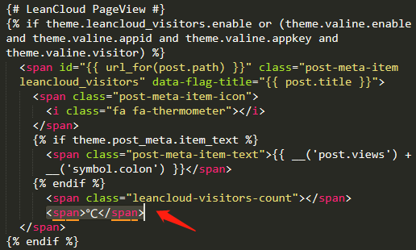

<blockquote class="blockquote-center">海阔凭鱼跃，天高任鸟飞。
</blockquote>

　　前几天，我写了一篇关于如何使用GitHub＋Hexo搭建个人博客的博文，接下来我会以我的博客为例，讲讲如何对NexT主题的个性化定制和一些细节的优化。

<!-- more -->

### 前言

　　这篇博客主要是next主题的个性化定制，还有一些细节的优化。在搭建的过程，有一些优化，也是参考了大量之前大佬的教程和结合了一些做的比较优秀的博客，我在这里做了一个集合，同时把自己做的而别人没有做的优化，写出来方便大家。

　　参考的文章我都会贴出原文链接，但是有一些优化，是我自己辛苦更改样式才做出来的效果，有些也是忘记了具体的修改方法，主要是直接审查元素，一点一点的定位到样式表，一点一点的测试修改，相信通过审查元素，你也可以做到。

### 安装NexT主题

　　我使用的是比较简约的[NexT](https://github.com/iissnan/hexo-theme-next)主题，如果你对其他主题感兴趣，可以点击[这里](https://github.com/search?o=desc&q=topic%3Ahexo-theme&s=stars&type=Repositories)。

　　安装方法：打开博客根目录下的**themes文件夹**，右键**Git Bash**，运行命令：`git clone https://github.com/iissnan/hexo-theme-next themes/next`

　　下载好之后，把hexo-theme-next改为next，接着打开next目录下的主题配置文件_config.yml，找到theme字段，把参数改为theme: next，之后在根目录下运行：

```
hexo clean
hexo s -g
```

#### 关于_config.yml

　　首先_config.yml，它是主题配置文件，有两个，名字一样比较容易混淆。

- 站点配置文件，位于站点文件夹的根目录下

例如我的是`H:/blog/_config.yml`

- 主题配置文件，位于主题文件夹的根目录下

例如我的是`H:/blog/themes/next/_config.yml`

　　Next这个主题包含4钟风格，默认的是Muse，我使用的是**Pisces**。你也可以尝试其他风格，具体操作：打开`H:/blog/_config.yml`，定位到Schemes，想要哪款主题就取消前面的**#**。

```
# Schemes
#scheme: Muse
#scheme: Mist
scheme: Pisces
#scheme: Gemini
```

### Next主题美化

接下来就是主题的美化啦


#### 添加Github丝带或者角标

效果图


实现方法

　　首先先点击[这里](https://github.com/blog/273-github-ribbons)或者[这里](http://tholman.com/github-corners/)挑选自己喜欢的样式，并复制代码。


　　打开`themes/next/layout/_layout.swig`文件，在`<header></header>`之前添加代码，并把`href`改为你的博客地址


#### 添加RSS订阅

效果图


实现方法

　　首先在博客的根目录`H:/blog`，安装Hexo插件，插件会放在`node_modules`这个文件夹。

```
npm install --save hexo-generator-feed
```

　　接下来打开`H:/blog/_config.yml`文件，在末尾添加

```
# Extensions
## Plugins: http://hexo.io/plugins/
# RSS订阅
plugin: hexo-generator-feed
```

　　然后打开`H:/blog/themes/next/_config.yml`文件,找到rss，添加参数

```
# hexo-generator-feed required for rss support. Leave rss as blank to use site's feed link.
# Set rss to false to disable feed link. Set rss to specific value if you have burned your feed already.
rss: /atom.xml
```

#### 添加动态背景

效果图


实现方法

打开`H:/blog/_config.yml`文件，找到`canvas_nest`,把false改为true

```
canvas_nest:
  enable: true
  onmobile: true # display on mobile or not
  color: "0,0,255" # 线条颜色，三个数字分别为(R,G,B)
  opacity: 0.5 # 线条透明度（0~1）
  zIndex: -1 # 背景的z-index属性
  count: 99 # 线条的总数量
```

#### 鼠标点击特效

效果图


实现方法

　　打开`H:/blog/themes/next/source/js/src`，新建一个firework.js文件，加入以下代码：

`"use strict";function updateCoords(e){pointerX=(e.clientX||e.touches[0].clientX)-canvasEl.getBoundingClientRect().left,pointerY=e.clientY||e.touches[0].clientY-canvasEl.getBoundingClientRect().top}function setParticuleDirection(e){var t=anime.random(0,360)*Math.PI/180,a=anime.random(50,180),n=[-1,1][anime.random(0,1)]*a;return{x:e.x+n*Math.cos(t),y:e.y+n*Math.sin(t)}}function createParticule(e,t){var a={};return a.x=e,a.y=t,a.color=colors[anime.random(0,colors.length-1)],a.radius=anime.random(16,32),a.endPos=setParticuleDirection(a),a.draw=function(){ctx.beginPath(),ctx.arc(a.x,a.y,a.radius,0,2*Math.PI,!0),ctx.fillStyle=a.color,ctx.fill()},a}function createCircle(e,t){var a={};return a.x=e,a.y=t,a.color="#F00",a.radius=0.1,a.alpha=0.5,a.lineWidth=6,a.draw=function(){ctx.globalAlpha=a.alpha,ctx.beginPath(),ctx.arc(a.x,a.y,a.radius,0,2*Math.PI,!0),ctx.lineWidth=a.lineWidth,ctx.strokeStyle=a.color,ctx.stroke(),ctx.globalAlpha=1},a}function renderParticule(e){for(var t=0;t<e.animatables.length;t++){e.animatables[t].target.draw()}}function animateParticules(e,t){for(var a=createCircle(e,t),n=[],i=0;i<numberOfParticules;i++){n.push(createParticule(e,t))}anime.timeline().add({targets:n,x:function(e){return e.endPos.x},y:function(e){return e.endPos.y},radius:0.1,duration:anime.random(1200,1800),easing:"easeOutExpo",update:renderParticule}).add({targets:a,radius:anime.random(80,160),lineWidth:0,alpha:{value:0,easing:"linear",duration:anime.random(600,800)},duration:anime.random(1200,1800),easing:"easeOutExpo",update:renderParticule,offset:0})}function debounce(e,t){var a;return function(){var n=this,i=arguments;clearTimeout(a),a=setTimeout(function(){e.apply(n,i)},t)}}var canvasEl=document.querySelector(".fireworks");if(canvasEl){var ctx=canvasEl.getContext("2d"),numberOfParticules=30,pointerX=0,pointerY=0,tap="mousedown",colors=["#FF1461","#18FF92","#5A87FF","#FBF38C"],setCanvasSize=debounce(function(){canvasEl.width=2*window.innerWidth,canvasEl.height=2*window.innerHeight,canvasEl.style.width=window.innerWidth+"px",canvasEl.style.height=window.innerHeight+"px",canvasEl.getContext("2d").scale(2,2)},500),render=anime({duration:1/0,update:function(){ctx.clearRect(0,0,canvasEl.width,canvasEl.height)}});document.addEventListener(tap,function(e){"sidebar"!==e.target.id&&"toggle-sidebar"!==e.target.id&&"A"!==e.target.nodeName&&"IMG"!==e.target.nodeName&&(render.play(),updateCoords(e),animateParticules(pointerX,pointerY))},!1),setCanvasSize(),window.addEventListener("resize",setCanvasSize,!1)}"use strict";function updateCoords(e){pointerX=(e.clientX||e.touches[0].clientX)-canvasEl.getBoundingClientRect().left,pointerY=e.clientY||e.touches[0].clientY-canvasEl.getBoundingClientRect().top}function setParticuleDirection(e){var t=anime.random(0,360)*Math.PI/180,a=anime.random(50,180),n=[-1,1][anime.random(0,1)]*a;return{x:e.x+n*Math.cos(t),y:e.y+n*Math.sin(t)}}function createParticule(e,t){var a={};return a.x=e,a.y=t,a.color=colors[anime.random(0,colors.length-1)],a.radius=anime.random(16,32),a.endPos=setParticuleDirection(a),a.draw=function(){ctx.beginPath(),ctx.arc(a.x,a.y,a.radius,0,2*Math.PI,!0),ctx.fillStyle=a.color,ctx.fill()},a}function createCircle(e,t){var a={};return a.x=e,a.y=t,a.color="#F00",a.radius=0.1,a.alpha=0.5,a.lineWidth=6,a.draw=function(){ctx.globalAlpha=a.alpha,ctx.beginPath(),ctx.arc(a.x,a.y,a.radius,0,2*Math.PI,!0),ctx.lineWidth=a.lineWidth,ctx.strokeStyle=a.color,ctx.stroke(),ctx.globalAlpha=1},a}function renderParticule(e){for(var t=0;t<e.animatables.length;t++){e.animatables[t].target.draw()}}function animateParticules(e,t){for(var a=createCircle(e,t),n=[],i=0;i<numberOfParticules;i++){n.push(createParticule(e,t))}anime.timeline().add({targets:n,x:function(e){return e.endPos.x},y:function(e){return e.endPos.y},radius:0.1,duration:anime.random(1200,1800),easing:"easeOutExpo",update:renderParticule}).add({targets:a,radius:anime.random(80,160),lineWidth:0,alpha:{value:0,easing:"linear",duration:anime.random(600,800)},duration:anime.random(1200,1800),easing:"easeOutExpo",update:renderParticule,offset:0})}function debounce(e,t){var a;return function(){var n=this,i=arguments;clearTimeout(a),a=setTimeout(function(){e.apply(n,i)},t)}}var canvasEl=document.querySelector(".fireworks");if(canvasEl){var ctx=canvasEl.getContext("2d"),numberOfParticules=30,pointerX=0,pointerY=0,tap="mousedown",colors=["#FF1461","#18FF92","#5A87FF","#FBF38C"],setCanvasSize=debounce(function(){canvasEl.width=2*window.innerWidth,canvasEl.height=2*window.innerHeight,canvasEl.style.width=window.innerWidth+"px",canvasEl.style.height=window.innerHeight+"px",canvasEl.getContext("2d").scale(2,2)},500),render=anime({duration:1/0,update:function(){ctx.clearRect(0,0,canvasEl.width,canvasEl.height)}});document.addEventListener(tap,function(e){"sidebar"!==e.target.id&&"toggle-sidebar"!==e.target.id&&"A"!==e.target.nodeName&&"IMG"!==e.target.nodeName&&(render.play(),updateCoords(e),animateParticules(pointerX,pointerY))},!1),setCanvasSize(),window.addEventListener("resize",setCanvasSize,!1)};`

　　然后在`H:/blog/themes/next/layout/_layout.swig`文件中，`</head>`之前加入以下代码：

```
<!-- 爆炸红心效果 -->
<canvas class="fireworks" style="position: fixed;left: 0;top: 0;z-index: 1; pointer-events: none;" ></canvas> 
<script type="text/javascript" src="//cdn.bootcss.com/animejs/2.2.0/anime.min.js"></script> 
<script type="text/javascript" src="/js/src/yanhuatexiao.js"></script>
```


　　还可以换成点击出现爱心的特效,方法是一样的。

`!function(e,t,a){function n(){c(".heart{width: 10px;height: 10px;position: fixed;background: #f00;transform: rotate(45deg);-webkit-transform: rotate(45deg);-moz-transform: rotate(45deg);}.heart:after,.heart:before{content: '';width: inherit;height: inherit;background: inherit;border-radius: 50%;-webkit-border-radius: 500%;-moz-border-radius: 50%;position: fixed;}.heart:after{top: -5px;}.heart:before{left: -5px;}"),o(),r()}function r(){for(var e=0;e<d.length;e++)d[e].alpha<=0?(t.body.removeChild(d[e].el),d.splice(e,1)):(d[e].y--,d[e].scale+=.004,d[e].alpha-=.013,d[e].el.style.cssText="left:"+d[e].x+"px;top:"+d[e].y+"px;opacity:"+d[e].alpha+";transform:scale("+d[e].scale+","+d[e].scale+") rotate(45deg);background:"+d[e].color+";z-index:99999");requestAnimationFrame(r)}function o(){var t="function"==typeof e.onclick&&e.onclick;e.οnclick=function(e){t&&t(),i(e)}}function i(e){var a=t.createElement("div");a.className="heart",d.push({el:a,x:e.clientX-5,y:e.clientY-5,scale:1,alpha:1,color:s()}),t.body.appendChild(a)}function c(e){var a=t.createElement("style");a.type="text/css";try{a.appendChild(t.createTextNode(e))}catch(t){a.styleSheet.cssText=e}t.getElementsByTagName("head")[0].appendChild(a)}function s(){return"rgb("+~~(255*Math.random())+","+~~(255*Math.random())+","+~~(255*Math.random())+")"}var d=[];e.requestAnimationFrame=function(){return e.requestAnimationFrame||e.webkitRequestAnimationFrame||e.mozRequestAnimationFrame||e.oRequestAnimationFrame||e.msRequestAnimationFrame||function(e){setTimeout(e,1e3/60)}}(),n()}(window,document);`

#### 修改超链接的颜色

效果图


实现方法

　　打开`H:\blog\themes\next\source\css\_common\components\post`文件夹下的`post.styl`,添加以下css样式：

```
.post-body p a {
  color: #0593d3;
  border-bottom: none;
  &:hover {
    color: #fc6423;
    text-decoration: underline;
  }
}
```

　　其中选择`.post-body` 是为了不影响标题，选择 `p` 是为了不影响首页“阅读全文”的显示样式,颜色可以自己定义。

#### 文章结尾添加结束标记

效果图


实现方法

　　打开`H:/blog/themes/next/layout/_macro`文件夹，新建`passage-end-tag.swig` 文件,并添加以下内容：

```
<div>
    
        <div style="text-align:center;color: #ccc;font-size:14px;">-------------本文结束<i class="fa fa-paw"></i>感谢您的阅读-------------</div>
    
</div>
```

　　然后打开`H:/blog/themes/next/layout/_macro/post.swig`文件，在`post-body` 之后， `post-footer` 之前添加以下代码：

```
<div>
  
    
  
</div>
```


　　接着在`H:/blog/themes/next/_config.yml`末尾添加：

```
# 文章末尾添加“本文结束”标记
passage_end_tag:
  enabled: true
```

#### 修改文章底部带#号的标签

效果图


实现方法

　　修改`H:/blog/themes/next/layout/_macro/post.swig`，搜索 `rel="tag">#`，将 # 换成`<i class="fa fa-tag"></i>`


#### 设置博客头像并旋转

效果图


实现方法

　　打开`H:/blog/themes/next/source/images`,把头像放到该目录下，然后打开`H:/blog/_config.yml`,找到`avatar:`，修改为以下内容：

```
avatar:
  # In theme directory (source/images): /images/avatar.gif
  # In site directory (source/uploads): /uploads/avatar.gif
  # You can also use other linking images.
  url: /images/avatar.gif
  # If true, the avatar would be dispalyed in circle.
  rounded: true
  # The value of opacity should be choose from 0 to 1 to set the opacity of the avatar.
  opacity: 1
  # If true, the avatar would be rotated with the cursor.
  rotated: true
```

#### 快速实现博客压缩

　　项目压缩也叫`代码丑化`, 分别对 html、css、js、images进行优化，即把重复的代码合并，把多余的空格去掉，用算法把 images 进行压缩。压缩后的博客，加载速度会有较大的提升，自然能留住更多游客。

　　蛮多朋友使用了`gulp`对博客进行压缩，这也是一个办法，但在社区逛了下，找到了一个比较好用的模块[hexo-all-minifier](https://github.com/chenzhutian/hexo-all-minifier)，这个模块集成了对 html、css、js、image 的优化。

```
npm install hexo-all-minifier --save
```

　　安装上此模块后，只要在根目录下的_config.yml文件中加上如下字段就可对博客所有内容进行压缩。

```
html_minifier:
  enable: true
  ignore_error: false
  exclude:

css_minifier:
  enable: true
  exclude:
    - '*.min.css'

js_minifier:
  enable: true
  mangle: true
  output:
  compress:
  exclude:
    - '*.min.js'

image_minifier:
  enable: true
  interlaced: false
  multipass: false
  optimizationLevel: 2
  pngquant: false
  progressive: false
```

#### 侧边栏添加社交图标

效果图


实现方法

　　打开主题配置文件`_config.yml`，搜索`social:`,在[图标库](http://fontawesome.io/icons/)找自己喜欢的小图标，并将名字复制在如下位置，保存即可


#### 主页文章添加阴影效果

效果图


实现方法

　　打开`H:\blog\themes\next\source\css\_common\components\post`文件夹下的`post.styl`,添加以下css样式：

```
// 主页文章添加阴影效果
 .post {
   margin-top: 0px;
   margin-bottom: 60px;
   padding: 25px;
   -webkit-box-shadow: 0 0 5px rgba(202, 203, 203, .5);
   -moz-box-shadow: 0 0 5px rgba(202, 203, 204, .5);
  }
```

#### 在博客底部添加访问量

效果图


实现方法

　　打开`H:/blog/themes/next/_config.yml`,找到`busuanzi`，修改为以下参数：

```
busuanzi_count:
  enable: true
  total_visitors: true
  total_visitors_icon: user
  total_views: true
  total_views_icon: eye
```

#### 使用leancloud统计页面访问次数

效果图


实现方法

　　主题集成了leancloud，但是我们还需要去[官网](https://leancloud.cn/)注册账号并实名，这里讲一下关键的步骤。

##### 配置leancloud

- 创建应用：`控制台 --> 创建应用（开发版）`

应用名称可以随意输入，后面还可以修改，我的是blog

- 创建class：

　　点击刚创建的应用，创建一个 Class 表用来保存我们的博客访问数据。此处创建的 Class 名字必须为 `Counter`，ACL 权限选择 `无限制`。

- 创建 Class 完成之后，新创建的 Counter 表会显示在左侧，这时再切换到 test 应用的 `设置 - 应用 Key` 界面：


- 复制ID和Key


##### 启用leancloud

　　打开`_config.yml`主题配置文件，找到`leancloud_visitors:`,填入id和key。


##### 修改热度

　　打开`H:/blog/themes/next/layout/_macro/post.swig`文件，找到`leancloud`,修改成如下代码：



　　最后打开`H:/blog/themes/next/languages/zh-CN.yml`,把views参数改成如下：


#### 博客标题设置

　　这个相关的设置在`H:/blog/_config.yml`中修改，如下图所示：


#### 博客底部添加网站的运行时间

效果图


实现方法

　　打开`H:/blog/themes/next/layout/_partials/footer.swig`，在末尾添加如下代码;

```
<!-- 网站运行时间的设置 -->
<span id="timeDate">载入天数...</span>
<span id="times">载入时分秒...</span>
<script>
    var now = new Date();
    function createtime() {
        var grt= new Date("07/12/2019 18:30:00");//此处修改你的建站时间或者网站上线时间
        now.setTime(now.getTime()+250);
        days = (now - grt ) / 1000 / 60 / 60 / 24; dnum = Math.floor(days);
        hours = (now - grt ) / 1000 / 60 / 60 - (24 * dnum); hnum = Math.floor(hours);
        if(String(hnum).length ==1 ){hnum = "0" + hnum;} minutes = (now - grt ) / 1000 /60 - (24 * 60 * dnum) - (60 * hnum);
        mnum = Math.floor(minutes); if(String(mnum).length ==1 ){mnum = "0" + mnum;}
        seconds = (now - grt ) / 1000 - (24 * 60 * 60 * dnum) - (60 * 60 * hnum) - (60 * mnum);
        snum = Math.round(seconds); if(String(snum).length ==1 ){snum = "0" + snum;}
        document.getElementById("timeDate").innerHTML = "网站已运行 "+dnum+" 天 ";
        document.getElementById("times").innerHTML = hnum + " 小时 " + mnum + " 分 " + snum + " 秒";
    }
setInterval("createtime()",250);
</script>
```

#### 添加 README.md 文件

　　每个项目下一般都有一个 `README.md` 文件，但是使用 hexo 部署到仓库后，项目下是没有 `README.md` 文件的。

　　在 Hexo 目录下的 `source` 根目录下添加一个 `README.md` 文件，修改站点配置文件 _`config.yml`，将 `skip_render` 参数的值设置为`skip_render: README.md`

　　保存退出即可。再次使用 `hexo d` 命令部署博客的时候就不会在渲染 README.md 这个文件了。

#### 自定义网站的图标

效果图


实现方法

　　我的图标是在[阿里矢量图标库](https://www.iconfont.cn/)下载的，你也可以在其他地方下载或者制作，然后把图标放在`H：/blog/themes/next/source/images`里面，斌且修改主题配置文件：

```
favicon:
  small: /images/favicon-16x16-next.png
  medium: /images/favicon-32x32-next.png
  apple_touch_icon: /images/apple-touch-icon-next.png
  safari_pinned_tab: /images/logo.svg
  #android_manifest: /images/manifest.json
  #ms_browserconfig: /images/browserconfig.xml
```

#### 文章字数、阅读时长统计

效果图


实现效果

　　　打开博客根目录，运行以下命令，安装插件

```
npm install hexo-symbols-count-time --save
```

　　然后修改博客配置文件，在末尾添加以下代码：

```
symbols_count_time:
  symbols: true                # 文章字数统计
  time: true                   # 文章阅读时长
  total_symbols: true          # 站点总字数统计
  total_time: true             # 站点总阅读时长
  exclude_codeblock: false     # 排除代码字数统计
```

　　最后在主题配置文件里面，找到`symbols_count_time`,修改成以下内容：

```
symbols_count_time:
  separated_meta: true     # 是否另起一行（true的话不和发表时间等同一行）
  item_text_post: true     # 首页文章统计数量前是否显示文字描述（本文字数、阅读时长）
  item_text_total: true    # 页面底部统计数量前是否显示文字描述（站点总字数、站点阅读时长）
  awl: 1.5                 # Average Word Length
  wpm: 100                 # Words Per Minute（每分钟阅读词数）
  suffix: mins.
```

#### 博客顶端添加加载条

效果图


实现方法

　　打开主题配置文件，找到`pace:`，修改为以下内容：

```
pace: true
# Themes list:
# pace-theme-big-counter | pace-theme-bounce | pace-theme-barber-shop | pace-theme-center-atom
# pace-theme-center-circle | pace-theme-center-radar | pace-theme-center-simple | pace-theme-corner-indicator
# pace-theme-fill-left | pace-theme-flash | pace-theme-loading-bar | pace-theme-mac-osx | pace-theme-minimal
pace_theme: pace-theme-minimal
```

#### 在文章底部添加版权信息

效果图


实现方法

　　打开`H：/blog/themes/next/layout/_macro`，添加`my-copyright.swig`，代码如下：

```

<div class="my_post_copyright">
  <script src="//cdn.bootcss.com/clipboard.js/1.5.10/clipboard.min.js"></script>
  
  <!-- JS库 sweetalert 可修改路径 -->
  <script type="text/javascript" src="http://jslibs.wuxubj.cn/sweetalert_mini/jquery-1.7.1.min.js"></script>
  <script src="http://jslibs.wuxubj.cn/sweetalert_mini/sweetalert.min.js"></script>
  <link rel="stylesheet" type="text/css" href="http://jslibs.wuxubj.cn/sweetalert_mini/sweetalert.mini.css">

  <p><span>本文标题:</span>{{ page.title }}</a></p>
  <p><span>文章作者:</span>{{ theme.author }}</a> | 【公众号：不会代码的程序猿】</p>
  <p><span>发布时间:</span>{{ page.date.format("YYYY年MM月DD日 HH:mm:ss") }}</p>
  <p><span>最后更新:</span>{{ page.updated.format("YYYY年MM月DD日 HH:mm:ss") }}</p>
  <p><span>原始链接:</span><a href="{{ url_for(page.path) }}" title="{{ page.title }}">{{ page.permalink }}</a></p>
  <p><span>许可协议:</span><i class="fa fa-creative-commons"></i> <a rel="license" href="https://creativecommons.org/licenses/by-nc-nd/4.0/" target="_blank" title="Attribution-NonCommercial-NoDerivatives 4.0 International (CC BY-NC-ND 4.0)">署名-非商业性使用-禁止演绎 4.0 国际</a> 转载请保留原文链接及作者。</p>  
</div>
<script> 
    var clipboard = new Clipboard('.fa-clipboard');
    clipboard.on('success', $(function(){
      $(".fa-clipboard").click(function(){
        swal({   
          title: "",   
          text: '复制成功',   
          html: false,
          timer: 500,   
          showConfirmButton: false
        });
      });
    }));  
</script>

```

　　然后在`H：/blog/themes/next/source/css/_common/components/post/`下添加`my-post-copyright.styl`：

```
.my_post_copyright {
  width: 85%;
  max-width: 45em;
  margin: 2.8em auto 0;
  padding: 0.5em 1.0em;
  border: 1px solid #d3d3d3;
  font-size: 0.93rem;
  line-height: 1.6em;
  word-break: break-all;
  background: rgba(255,255,255,0.4);
}
.my_post_copyright p{margin:0;}
.my_post_copyright span {
  display: inline-block;
  width: 5.2em;
  color: #333333; // title color
  font-weight: bold;
}
.my_post_copyright .raw {
  margin-left: 1em;
  width: 5em;
}
.my_post_copyright a {
  color: #808080;
  border-bottom:0;
}
.my_post_copyright a:hover {
  color: #0593d3; // link color
  text-decoration: underline;
}
.my_post_copyright:hover .fa-clipboard {
  color: #000;
}
.my_post_copyright .post-url:hover {
  font-weight: normal;
}
.my_post_copyright .copy-path {
  margin-left: 1em;
  width: 1em;
  +mobile(){display:none;}
}
.my_post_copyright .copy-path:hover {
  color: #808080;
  cursor: pointer;
}
```

　　然后打开`H:/blog/themes/next/layout/_macro/post.swig`文件，在`post-body` 之后， `post-footer` 之前添加以下代码：

```
<div>
   
      
   
</div>
```


　　最后修改`next/source/css/_common/components/post/post.styl`文件，在最后一行增加代码：

```
@import "my-post-copyright"
```

#### 添加来必力评论系统

效果图


实现方法

　　打开[来必力](https://www.livere.com/)的官网，注册，注册好之后打开设置页面，填写博客地址


　　然后在代码管理页面，把uid复制到主题配置文件`_config.yml`的`livere_uid:`


#### 修改博客底部的红色跳动爱心


　　打开主题配置文件，找到`footer:`，修改为以下内容：


#### DaoVoice在线联系

效果图


实现方法

　　先在 [daovoice](https://account.daocloud.io/signin) 注册账号，[邀请码](http://dashboard.daovoice.io/get-started?invite_code=0f81ff2f)是`dda712fb`，注册完成后会得到一个 app_id :


　　然后打开`/themes/next/layout/_partials/head.swig`,在末尾添加如下代码：

```

  <script>
  (function(i,s,o,g,r,a,m){i["DaoVoiceObject"]=r;i[r]=i[r]||function(){(i[r].q=i[r].q||[]).push(arguments)},i[r].l=1*new Date();a=s.createElement(o),m=s.getElementsByTagName(o)[0];a.async=1;a.src=g;a.charset="utf-8";m.parentNode.insertBefore(a,m)})(window,document,"script",('https:' == document.location.protocol ? 'https:' : 'http:') + "//widget.daovoice.io/widget/dda712fb.js","daovoice")
  daovoice('init', {
      app_id: "{{theme.daovoice_app_id}}"
    });
  daovoice('update');
  </script>

```


　　最后打开主题配置文件，在末尾添加如下代码：

```
# Online contact
daovoice: true
daovoice_app_id: 这里填你的刚才获得的 app_id
```

#### 设置博客摘要显示

　　打开主题配置文件，修改为以下内容：


　　这样就能实现在主页只展示部分文字，其他文字隐藏起来，通过点击’阅读更多’来阅读全文。在写每一篇文章的时候，也要在必要的地方添加`<!-- more -->`

```
---
title: 使用Github+Hexo搭建你的个人博客：搭建篇
copyright: true
date: 2019-07-21 15:25:12
categories: Hexo
tags: [GitHub,个人博客,Hexo]

---

<blockquote class="blockquote-center">海阔凭鱼跃，天高任鸟飞。
</blockquote>

　　早在初中，就想着自己搭起一个属于自己的网站，但是没有技术又不肯学习的我，怯于尝试，一直停滞不前。大学期间终于学习了，又因为自己的懒惰，觉得很难，不肯去尝试。直至今日，我想试一试，捣鼓了好一阵子，发现认真去做了，也没有想象中的难。

<!-- more -->
```

#### 文章链接唯一化

　　也许你会数次更改文章题目或者变更文章发布时间，在默认设置下，文章链接都会改变，不利于搜索引擎收录，也不利于分享。唯一永久链接才是更好的选择。

　　首先安装插件

```
npm install hexo-abbrlink --save
```

　　然后在站点配置文件中找到`permalink`，修改为如下内容：

```
permalink: posts/:abbrlink/  # “posts/” 可自行更换
```

　　这里有个知识点：

> 百度蜘蛛抓取网页的规则: 对于蜘蛛说网页权重越高、信用度越高抓取越频繁，例如网站的首页和内页。蜘蛛先抓取网站的首页，因为首页权重更高，并且大部分的链接都是指向首页。然后通过首页抓取网站的内页，并不是所有内页蜘蛛都会去抓取。

　　搜索引擎认为对于一般的中小型站点，3层足够承受所有的内容了，所以蜘蛛经常抓取的内容是前三层，而超过三层的内容蜘蛛认为那些内容并不重要，所以不经常爬取。出于这个原因所以permalink后面跟着的最好不要超过2个斜杠。

　　接着在站点配置文件中添加如下代码:

```
# abbrlink config
abbrlink:  alg: crc32  # 算法：crc16(default) and crc32
rep: hex    # 进制：dec(default) and hex
```

可选择模式：

- crc16 & hex

- crc16 & dec

- crc32 & hex

- crc32 & dec

#### 修改顶端的线条颜色

　　next主题顶端的线条颜色默认是黑色的，我看着不舒服就把它改成了粉色

效果图


实现方法

　　打开`themes/next/source/css/_variables/base.styl`,找到`headband`，修改为以下内容：

```
// Headband
// --------------------------------------------------
$headband-height                = 2px
$headband-bg                    = #e3cae4
```

#### 去除文章下方分类于的下划线

　　打开`themes/next/source/css/_common/scaffolding/base.styl`,找到`span.exturl`，修改为以下内容：

```
a, span.exturl {
  word-wrap();
  // Remove the gray background color from active links in IE 10.
  background-color: transparent;
  color: #999999;
  text-decoration: none;
  outline: none;
  border-bottom: 0px solid $link-decoration-color;
```


#### 左侧社交图标居中

　　强迫症的我居然发现了左侧社交图标似乎不太居中啊，一定得把它搞居中。

效果图


实现方法

　　打开`themes/next/source/css/_schemes/Pisces/_sidebar.styl`,找到`.site-overview`，修改为以下内容：

```
.site-overview {
  //margin: 0 2px;
  text-align:
}
```


#### 建立阅读排行榜

　　新建一个阅读排行榜界面，，用于显示本站文章的阅读排行榜，基于lencloud进行统计

##### 新建页面

　　`hexo n page top` 新建页面，生成 top 目录，编辑其中自动生成的 index.md 文件，将其中的代码替换如下：

```
<div id="top"></div>
<script src="https://cdn1.lncld.net/static/js/av-core-mini-0.6.4.js"></script>
<script>AV.initialize("leancloud_appid这里填入你的id", "leancloud_appkey这里填入你的key");</script>
<script type="text/javascript">
  var time=0
  var title=""
  var url=""
  var query = new AV.Query('Counter');
  query.notEqualTo('id',0);
  query.descending('time');
  query.limit(1000);
  query.find().then(function (todo) {
    for (var i=0;i<1000;i++){
      var result=todo[i].attributes;
      time=result.time;
      title=result.title;
      url=result.url;
      // var content="<a href='"+"https://hoxis.github.io"+url+"'>"+title+"</a>"+"<br>"+"<font color='#fff'>"+"阅读次数："+time+"</font>"+"<br><br>";
      var content="<p>"+"<font color='#e20404'>"+"【热度"+time+"℃】"+"："+"<a href='"+"https://xiaoxiaoxiaoxiaolin.github.io"+url+"'>"+title+"</a>"+"</p>";
      document.getElementById("top").innerHTML+=content
    }
  }, function (error) {
    console.log("error");
  });
</script>
```

　　里面的`leancloud_appid`、`leancloud_appkey` 还有页面链接记得替换成你的。

##### 编辑菜单

　　打开主题配置文件，添加top：

```
menu:
  home: / || home
  top: /top/ || signal
  categories: /categories/ || th
  tags: /tags/ || tags
  archives: /archives/ || archive
  about: /about/ || user
```

　　然后还需要对中文配置`hexo/blog/themes/next/languages/zh-CN.yml`进行修改，添加top对应的中文：

```
menu:
  home: 首页
  top: 热榜
  archives: 归档
  categories: 分类
  tags: 标签
  about: 关于
  search: 搜索
  schedule: 日程表
  sitemap: 站点地图
  commonweal: 公益 404
```

#### github分支管理博客

　　使用hexo发布博客最麻烦的地方在于，当你换了一台电脑后又想发布博客，又得把先前的环境重新搭建，拉取仓库。因为在github中的我们github.io项目是只有编译后的文件的，没有源文件的，也就是说，如果我们的电脑坏了，打不开了，我们的博客就不能进行更新了，所以我们要把我们的源文件也上传到github上。这个时候可以选择新建一个仓库来存放源文件，也可以把源文件 push 到 user.github.io 的其他分支。我选择了后者。

##### 创建分支

　　创建两个分支：master 与 hexo,（这个hexo分支就是存放我们源文件的分支，我们只需要更新hexo分支上的内容据就好，master上的分支hexo编译的时候会更新的）

##### 初始化仓库

　　然后我们再初始化仓库，重新对我们的代码进行版本控制

```
git init
git remote add origin <server>
```

　　`<server>`是指在线仓库的地址。origin是本地分支,remote add操作会将本地仓库映射到云端

##### 将博客源文件上传到分支

　　.gitignore文件作用是声明不被git记录的文件，blog根目录下的.gitignore是hexo初始化带来的，可以先删除或者直接编辑，对hexo不会有影响。建议.gitignore内添加以下内容：

```
/.deploy_git
/public
/_config.yml
```

　　.deploy_git是hexo默认的.git配置文件夹，不需要同步
　　public内文件是根据source文件夹内容自动生成，不需要备份，不然每次改动内容太多
　　即使是私有仓库，除去在线服务商员工可以看到的风险外，还有云服务商被攻击造成泄漏等可能，所以不建议将配置文件传上去

##### 依次执行

```
git add .
git commit -m "..."
git push origin hexo
```

#### 更改标签云的颜色

　　打开`/blog/themes/next/layout/page.swig`，找到tagcloud，修改为以下内容：

```
{{ tagcloud({min_font: 13, max_font: 31, amount: 1000, color: true, start_color: '#9733EE', end_color: '#FF512F'}) }}
```

　　　`start_color`和`end_color`的颜色你可以自己随意定义。

### 参考资料：

- #### [使用 Hexo 搭建 GitHub Page 博客(二)--使用 GitHub 分支保存 Hexo 环境和博文](https://blog.csdn.net/gatieme/article/details/82317704)

- #### [hexo 摸爬滚打之进阶教程](http://muyunyun.cn/posts/f55182c5/#more)

- [GitHub--创建新的分支(转)](https://www.cnblogs.com/autoXingJY/p/9004724.html)

- #### [打造个性超赞博客 Hexo + NexT + GitHub Pages 的超深度优化](https://io-oi.me/tech/hexo-next-optimization.html)

- [hexo的next主题个性化教程:打造炫酷网站 | Moorez](shenzekun.cn/hexo的next主题个性化配置教程.html)

- #### [4块钱,用Github+Hexo搭建你的个人博客：美化篇](http://www.makcyun.top/2018/07/17/hexo02.html)

　　还有一些参考的资料链接已经找不到了，所以就不一一列出了。第一次写，如有错误，欢迎指出，不胜感激。